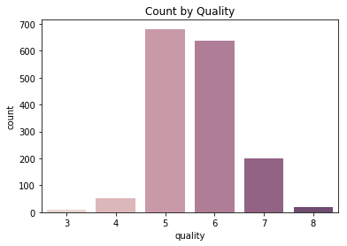
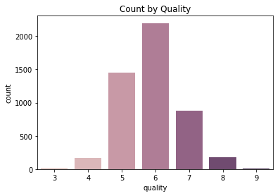

# A Journal of Wine

This project is written with the intent to learn and teach others the necessities of machine learning. It is made possible with the datasets wine-quality-red.csv and wine-quality-white.csv, both are retrieved from the University of Massachusetts: 

http://mlr.cs.umass.edu/ml/machine-learning-databases/wine-quality/winequality-red.csv

http://mlr.cs.umass.edu/ml/machine-learning-databases/wine-quality/winequality-white.csv

## Part 1: Red Wine Quality Regression

​	./Red Wine

Built and compared different regression models to predict red wine ratings, head to the above location to begin.

A preview of what is predicted:

## Part 2: White Wine Quality Regression

​	./White Wine

Uses the same procedure as part 1 to build a model. It concludes some hypotheses and assumptions made in part 1

## Part 3: Red vs. White Wine Classifier

​	./RW Classify

This uses undersampling to create a classifier to predict the type of wine based on its features