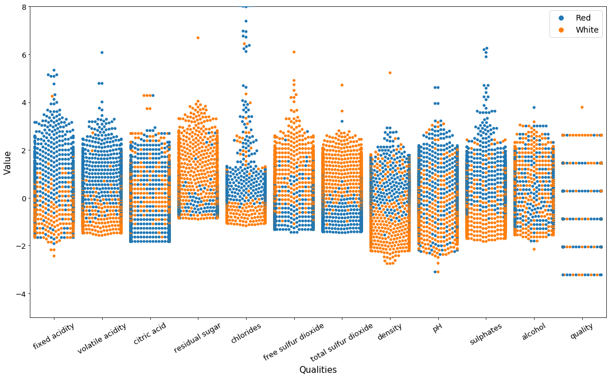

# A Predictor of Red and White Wine

This part 3/3 of the Journal of Wine series uses both the red wine and the white wine datasets to construct a classifier to predict red wine vs. white wine. 

# Load Modules


```python
# Graphs and array operations
import numpy as np
import pandas as pd
import seaborn as sns 
from matplotlib import pyplot as plt 

%matplotlib inline
# IPython Notebook function, just ignore

from sklearn.model_selection import train_test_split # split data
from sklearn.preprocessing import StandardScaler # for scaling
from sklearn.pipeline import make_pipeline # for grouping scaler and model into a wrapper called pipeline, goes into GridSearch
from sklearn.model_selection import GridSearchCV # for cross-validation, determines best hyperparameters

# Performance measures
from sklearn.metrics import confusion_matrix
from sklearn.metrics import classification_report

# Saving model
from sklearn.externals import joblib 

# Models to be used:
from sklearn.linear_model import LogisticRegression
from sklearn.svm import SVC
```

# Load Datasets


```python
dataset_url_red = '../Red Wine/wine-quality-red.csv'
data_red = pd.read_csv(dataset_url_red, sep = ";")
dataset_url_white = '../White Wine/wine-quality-white.csv'
data_white = pd.read_csv(dataset_url_white, sep = ";")

data_red_len = data_red.shape[0]
data_white_len = data_white.shape[0]
print("size of red wine dataset: %d" % data_red_len)
print("size of white wine dataset: %d\n" % data_white_len)

print("Red Wine: ")
display(data_red.head())
print("White Wine: ")
display(data_white.head())
```

    size of red wine dataset: 1599
    size of white wine dataset: 4898
    
    Red Wine: 


<div>
<style scoped>
    .dataframe tbody tr th:only-of-type {
        vertical-align: middle;
    }

    .dataframe tbody tr th {
        vertical-align: top;
    }
    
    .dataframe thead th {
        text-align: right;
    }
</style>
<table border="1" class="dataframe">
  <thead>
    <tr style="text-align: right;">
      <th></th>
      <th>fixed acidity</th>
      <th>volatile acidity</th>
      <th>citric acid</th>
      <th>residual sugar</th>
      <th>chlorides</th>
      <th>free sulfur dioxide</th>
      <th>total sulfur dioxide</th>
      <th>density</th>
      <th>pH</th>
      <th>sulphates</th>
      <th>alcohol</th>
      <th>quality</th>
    </tr>
  </thead>
  <tbody>
    <tr>
      <th>0</th>
      <td>7.4</td>
      <td>0.70</td>
      <td>0.00</td>
      <td>1.9</td>
      <td>0.076</td>
      <td>11.0</td>
      <td>34.0</td>
      <td>0.9978</td>
      <td>3.51</td>
      <td>0.56</td>
      <td>9.4</td>
      <td>5</td>
    </tr>
    <tr>
      <th>1</th>
      <td>7.8</td>
      <td>0.88</td>
      <td>0.00</td>
      <td>2.6</td>
      <td>0.098</td>
      <td>25.0</td>
      <td>67.0</td>
      <td>0.9968</td>
      <td>3.20</td>
      <td>0.68</td>
      <td>9.8</td>
      <td>5</td>
    </tr>
    <tr>
      <th>2</th>
      <td>7.8</td>
      <td>0.76</td>
      <td>0.04</td>
      <td>2.3</td>
      <td>0.092</td>
      <td>15.0</td>
      <td>54.0</td>
      <td>0.9970</td>
      <td>3.26</td>
      <td>0.65</td>
      <td>9.8</td>
      <td>5</td>
    </tr>
    <tr>
      <th>3</th>
      <td>11.2</td>
      <td>0.28</td>
      <td>0.56</td>
      <td>1.9</td>
      <td>0.075</td>
      <td>17.0</td>
      <td>60.0</td>
      <td>0.9980</td>
      <td>3.16</td>
      <td>0.58</td>
      <td>9.8</td>
      <td>6</td>
    </tr>
    <tr>
      <th>4</th>
      <td>7.4</td>
      <td>0.70</td>
      <td>0.00</td>
      <td>1.9</td>
      <td>0.076</td>
      <td>11.0</td>
      <td>34.0</td>
      <td>0.9978</td>
      <td>3.51</td>
      <td>0.56</td>
      <td>9.4</td>
      <td>5</td>
    </tr>
  </tbody>
</table>
</div>


    White Wine: 


<div>
<style scoped>
    .dataframe tbody tr th:only-of-type {
        vertical-align: middle;
    }

    .dataframe tbody tr th {
        vertical-align: top;
    }
    
    .dataframe thead th {
        text-align: right;
    }
</style>
<table border="1" class="dataframe">
  <thead>
    <tr style="text-align: right;">
      <th></th>
      <th>fixed acidity</th>
      <th>volatile acidity</th>
      <th>citric acid</th>
      <th>residual sugar</th>
      <th>chlorides</th>
      <th>free sulfur dioxide</th>
      <th>total sulfur dioxide</th>
      <th>density</th>
      <th>pH</th>
      <th>sulphates</th>
      <th>alcohol</th>
      <th>quality</th>
    </tr>
  </thead>
  <tbody>
    <tr>
      <th>0</th>
      <td>7.0</td>
      <td>0.27</td>
      <td>0.36</td>
      <td>20.7</td>
      <td>0.045</td>
      <td>45.0</td>
      <td>170.0</td>
      <td>1.0010</td>
      <td>3.00</td>
      <td>0.45</td>
      <td>8.8</td>
      <td>6</td>
    </tr>
    <tr>
      <th>1</th>
      <td>6.3</td>
      <td>0.30</td>
      <td>0.34</td>
      <td>1.6</td>
      <td>0.049</td>
      <td>14.0</td>
      <td>132.0</td>
      <td>0.9940</td>
      <td>3.30</td>
      <td>0.49</td>
      <td>9.5</td>
      <td>6</td>
    </tr>
    <tr>
      <th>2</th>
      <td>8.1</td>
      <td>0.28</td>
      <td>0.40</td>
      <td>6.9</td>
      <td>0.050</td>
      <td>30.0</td>
      <td>97.0</td>
      <td>0.9951</td>
      <td>3.26</td>
      <td>0.44</td>
      <td>10.1</td>
      <td>6</td>
    </tr>
    <tr>
      <th>3</th>
      <td>7.2</td>
      <td>0.23</td>
      <td>0.32</td>
      <td>8.5</td>
      <td>0.058</td>
      <td>47.0</td>
      <td>186.0</td>
      <td>0.9956</td>
      <td>3.19</td>
      <td>0.40</td>
      <td>9.9</td>
      <td>6</td>
    </tr>
    <tr>
      <th>4</th>
      <td>7.2</td>
      <td>0.23</td>
      <td>0.32</td>
      <td>8.5</td>
      <td>0.058</td>
      <td>47.0</td>
      <td>186.0</td>
      <td>0.9956</td>
      <td>3.19</td>
      <td>0.40</td>
      <td>9.9</td>
      <td>6</td>
    </tr>
  </tbody>
</table>
</div>


As you can see, the size of the white wine dataset is significantly larger than the red wine dataset. This will naturally cause our classifier to biasly predict white wine more. Hence, we introduce an technique called undersampling

# Undersample


```python
data_white_us_index = np.random.choice(data_white.index, data_red_len, replace=False)
data_white_us = data_white.loc[data_white_us_index]

print("Red wine size again: %d" % data_red_len)
print("White wine undersampled size: %d" % data_white_us.shape[0])
```

    Red wine size again: 1599
    White wine undersampled size: 1599


Now, after resampling, we add labels of 'Red' and 'White' to the datasets. 


```python
data_red['label'] = pd.Series('Red', data_red.index)
print("Final red wine dataset: ")
display(data_red.head())

print("Final white wine dataset: ")
data_white_us['label'] = pd.Series('White', data_white_us.index)
display(data_white_us.head())
```

    Final red wine dataset: 


<div>
<style scoped>
    .dataframe tbody tr th:only-of-type {
        vertical-align: middle;
    }

    .dataframe tbody tr th {
        vertical-align: top;
    }
    
    .dataframe thead th {
        text-align: right;
    }
</style>
<table border="1" class="dataframe">
  <thead>
    <tr style="text-align: right;">
      <th></th>
      <th>fixed acidity</th>
      <th>volatile acidity</th>
      <th>citric acid</th>
      <th>residual sugar</th>
      <th>chlorides</th>
      <th>free sulfur dioxide</th>
      <th>total sulfur dioxide</th>
      <th>density</th>
      <th>pH</th>
      <th>sulphates</th>
      <th>alcohol</th>
      <th>quality</th>
      <th>label</th>
    </tr>
  </thead>
  <tbody>
    <tr>
      <th>0</th>
      <td>7.4</td>
      <td>0.70</td>
      <td>0.00</td>
      <td>1.9</td>
      <td>0.076</td>
      <td>11.0</td>
      <td>34.0</td>
      <td>0.9978</td>
      <td>3.51</td>
      <td>0.56</td>
      <td>9.4</td>
      <td>5</td>
      <td>Red</td>
    </tr>
    <tr>
      <th>1</th>
      <td>7.8</td>
      <td>0.88</td>
      <td>0.00</td>
      <td>2.6</td>
      <td>0.098</td>
      <td>25.0</td>
      <td>67.0</td>
      <td>0.9968</td>
      <td>3.20</td>
      <td>0.68</td>
      <td>9.8</td>
      <td>5</td>
      <td>Red</td>
    </tr>
    <tr>
      <th>2</th>
      <td>7.8</td>
      <td>0.76</td>
      <td>0.04</td>
      <td>2.3</td>
      <td>0.092</td>
      <td>15.0</td>
      <td>54.0</td>
      <td>0.9970</td>
      <td>3.26</td>
      <td>0.65</td>
      <td>9.8</td>
      <td>5</td>
      <td>Red</td>
    </tr>
    <tr>
      <th>3</th>
      <td>11.2</td>
      <td>0.28</td>
      <td>0.56</td>
      <td>1.9</td>
      <td>0.075</td>
      <td>17.0</td>
      <td>60.0</td>
      <td>0.9980</td>
      <td>3.16</td>
      <td>0.58</td>
      <td>9.8</td>
      <td>6</td>
      <td>Red</td>
    </tr>
    <tr>
      <th>4</th>
      <td>7.4</td>
      <td>0.70</td>
      <td>0.00</td>
      <td>1.9</td>
      <td>0.076</td>
      <td>11.0</td>
      <td>34.0</td>
      <td>0.9978</td>
      <td>3.51</td>
      <td>0.56</td>
      <td>9.4</td>
      <td>5</td>
      <td>Red</td>
    </tr>
  </tbody>
</table>
</div>


    Final white wine dataset: 


<div>
<style scoped>
    .dataframe tbody tr th:only-of-type {
        vertical-align: middle;
    }

    .dataframe tbody tr th {
        vertical-align: top;
    }
    
    .dataframe thead th {
        text-align: right;
    }
</style>
<table border="1" class="dataframe">
  <thead>
    <tr style="text-align: right;">
      <th></th>
      <th>fixed acidity</th>
      <th>volatile acidity</th>
      <th>citric acid</th>
      <th>residual sugar</th>
      <th>chlorides</th>
      <th>free sulfur dioxide</th>
      <th>total sulfur dioxide</th>
      <th>density</th>
      <th>pH</th>
      <th>sulphates</th>
      <th>alcohol</th>
      <th>quality</th>
      <th>label</th>
    </tr>
  </thead>
  <tbody>
    <tr>
      <th>1903</th>
      <td>7.8</td>
      <td>0.34</td>
      <td>0.27</td>
      <td>1.2</td>
      <td>0.040</td>
      <td>25.0</td>
      <td>106.0</td>
      <td>0.9932</td>
      <td>3.01</td>
      <td>0.55</td>
      <td>10.4</td>
      <td>5</td>
      <td>White</td>
    </tr>
    <tr>
      <th>237</th>
      <td>6.8</td>
      <td>0.52</td>
      <td>0.32</td>
      <td>13.2</td>
      <td>0.044</td>
      <td>54.0</td>
      <td>221.0</td>
      <td>0.9972</td>
      <td>3.27</td>
      <td>0.50</td>
      <td>9.6</td>
      <td>6</td>
      <td>White</td>
    </tr>
    <tr>
      <th>4808</th>
      <td>7.3</td>
      <td>0.35</td>
      <td>0.67</td>
      <td>8.3</td>
      <td>0.053</td>
      <td>10.0</td>
      <td>100.0</td>
      <td>0.9959</td>
      <td>3.19</td>
      <td>0.50</td>
      <td>10.9</td>
      <td>5</td>
      <td>White</td>
    </tr>
    <tr>
      <th>3465</th>
      <td>6.8</td>
      <td>0.19</td>
      <td>0.34</td>
      <td>1.9</td>
      <td>0.040</td>
      <td>41.0</td>
      <td>108.0</td>
      <td>0.9900</td>
      <td>3.25</td>
      <td>0.45</td>
      <td>12.9</td>
      <td>6</td>
      <td>White</td>
    </tr>
    <tr>
      <th>409</th>
      <td>8.2</td>
      <td>0.28</td>
      <td>0.42</td>
      <td>1.8</td>
      <td>0.031</td>
      <td>30.0</td>
      <td>93.0</td>
      <td>0.9917</td>
      <td>3.09</td>
      <td>0.39</td>
      <td>11.4</td>
      <td>5</td>
      <td>White</td>
    </tr>
  </tbody>
</table>
</div>


Now, we merge these datasets to create the dataframe used for machine learning models.


```python
df = pd.concat([data_red, data_white_us], axis=0)
print("Final data head: ")
display(df[0:5])
print("\nFinal data tail: ")
display(df[-5:])
```

    Final data head: 


<div>
<style scoped>
    .dataframe tbody tr th:only-of-type {
        vertical-align: middle;
    }

    .dataframe tbody tr th {
        vertical-align: top;
    }
    
    .dataframe thead th {
        text-align: right;
    }
</style>
<table border="1" class="dataframe">
  <thead>
    <tr style="text-align: right;">
      <th></th>
      <th>fixed acidity</th>
      <th>volatile acidity</th>
      <th>citric acid</th>
      <th>residual sugar</th>
      <th>chlorides</th>
      <th>free sulfur dioxide</th>
      <th>total sulfur dioxide</th>
      <th>density</th>
      <th>pH</th>
      <th>sulphates</th>
      <th>alcohol</th>
      <th>quality</th>
      <th>label</th>
    </tr>
  </thead>
  <tbody>
    <tr>
      <th>0</th>
      <td>7.4</td>
      <td>0.70</td>
      <td>0.00</td>
      <td>1.9</td>
      <td>0.076</td>
      <td>11.0</td>
      <td>34.0</td>
      <td>0.9978</td>
      <td>3.51</td>
      <td>0.56</td>
      <td>9.4</td>
      <td>5</td>
      <td>Red</td>
    </tr>
    <tr>
      <th>1</th>
      <td>7.8</td>
      <td>0.88</td>
      <td>0.00</td>
      <td>2.6</td>
      <td>0.098</td>
      <td>25.0</td>
      <td>67.0</td>
      <td>0.9968</td>
      <td>3.20</td>
      <td>0.68</td>
      <td>9.8</td>
      <td>5</td>
      <td>Red</td>
    </tr>
    <tr>
      <th>2</th>
      <td>7.8</td>
      <td>0.76</td>
      <td>0.04</td>
      <td>2.3</td>
      <td>0.092</td>
      <td>15.0</td>
      <td>54.0</td>
      <td>0.9970</td>
      <td>3.26</td>
      <td>0.65</td>
      <td>9.8</td>
      <td>5</td>
      <td>Red</td>
    </tr>
    <tr>
      <th>3</th>
      <td>11.2</td>
      <td>0.28</td>
      <td>0.56</td>
      <td>1.9</td>
      <td>0.075</td>
      <td>17.0</td>
      <td>60.0</td>
      <td>0.9980</td>
      <td>3.16</td>
      <td>0.58</td>
      <td>9.8</td>
      <td>6</td>
      <td>Red</td>
    </tr>
    <tr>
      <th>4</th>
      <td>7.4</td>
      <td>0.70</td>
      <td>0.00</td>
      <td>1.9</td>
      <td>0.076</td>
      <td>11.0</td>
      <td>34.0</td>
      <td>0.9978</td>
      <td>3.51</td>
      <td>0.56</td>
      <td>9.4</td>
      <td>5</td>
      <td>Red</td>
    </tr>
  </tbody>
</table>
</div>


​    
    Final data tail: 


<div>
<style scoped>
    .dataframe tbody tr th:only-of-type {
        vertical-align: middle;
    }

    .dataframe tbody tr th {
        vertical-align: top;
    }
    
    .dataframe thead th {
        text-align: right;
    }
</style>
<table border="1" class="dataframe">
  <thead>
    <tr style="text-align: right;">
      <th></th>
      <th>fixed acidity</th>
      <th>volatile acidity</th>
      <th>citric acid</th>
      <th>residual sugar</th>
      <th>chlorides</th>
      <th>free sulfur dioxide</th>
      <th>total sulfur dioxide</th>
      <th>density</th>
      <th>pH</th>
      <th>sulphates</th>
      <th>alcohol</th>
      <th>quality</th>
      <th>label</th>
    </tr>
  </thead>
  <tbody>
    <tr>
      <th>4696</th>
      <td>6.1</td>
      <td>0.15</td>
      <td>0.40</td>
      <td>1.2</td>
      <td>0.030</td>
      <td>19.0</td>
      <td>84.0</td>
      <td>0.98926</td>
      <td>3.19</td>
      <td>0.96</td>
      <td>13.0</td>
      <td>6</td>
      <td>White</td>
    </tr>
    <tr>
      <th>3281</th>
      <td>6.5</td>
      <td>0.32</td>
      <td>0.30</td>
      <td>2.3</td>
      <td>0.051</td>
      <td>20.0</td>
      <td>127.0</td>
      <td>0.98964</td>
      <td>3.13</td>
      <td>0.52</td>
      <td>12.8</td>
      <td>6</td>
      <td>White</td>
    </tr>
    <tr>
      <th>1788</th>
      <td>8.2</td>
      <td>0.36</td>
      <td>0.29</td>
      <td>7.6</td>
      <td>0.035</td>
      <td>37.0</td>
      <td>122.0</td>
      <td>0.99390</td>
      <td>3.16</td>
      <td>0.34</td>
      <td>12.0</td>
      <td>5</td>
      <td>White</td>
    </tr>
    <tr>
      <th>2658</th>
      <td>6.5</td>
      <td>0.15</td>
      <td>0.44</td>
      <td>12.6</td>
      <td>0.052</td>
      <td>65.0</td>
      <td>158.0</td>
      <td>0.99688</td>
      <td>3.26</td>
      <td>0.70</td>
      <td>10.3</td>
      <td>7</td>
      <td>White</td>
    </tr>
    <tr>
      <th>1266</th>
      <td>7.5</td>
      <td>0.28</td>
      <td>0.34</td>
      <td>4.2</td>
      <td>0.028</td>
      <td>36.0</td>
      <td>116.0</td>
      <td>0.99100</td>
      <td>2.99</td>
      <td>0.41</td>
      <td>12.3</td>
      <td>8</td>
      <td>White</td>
    </tr>
  </tbody>
</table>
</div>


Note that all the red wines are in the beginning and all the white wines are at the end. This will be a threat when we partition the data for cross validation (depending on how you implement it, but we will fix it now). Hence, we will shuffle the dataset right now.

Explanation:

    df.sample 
        samples a fraction of the df in random order, using frac=1 tells sample to pick out everything
    reset_index 
        self-explanatory, it resets the index, since df.sample preserves the previous index


```python
df = df.sample(frac=1).reset_index(drop=True)
print("After shuffling: ")
df.head()
```

    After shuffling: 


<div>
<style scoped>
    .dataframe tbody tr th:only-of-type {
        vertical-align: middle;
    }

    .dataframe tbody tr th {
        vertical-align: top;
    }
    
    .dataframe thead th {
        text-align: right;
    }
</style>
<table border="1" class="dataframe">
  <thead>
    <tr style="text-align: right;">
      <th></th>
      <th>fixed acidity</th>
      <th>volatile acidity</th>
      <th>citric acid</th>
      <th>residual sugar</th>
      <th>chlorides</th>
      <th>free sulfur dioxide</th>
      <th>total sulfur dioxide</th>
      <th>density</th>
      <th>pH</th>
      <th>sulphates</th>
      <th>alcohol</th>
      <th>quality</th>
      <th>label</th>
    </tr>
  </thead>
  <tbody>
    <tr>
      <th>0</th>
      <td>7.2</td>
      <td>0.16</td>
      <td>0.29</td>
      <td>1.0</td>
      <td>0.031</td>
      <td>40.0</td>
      <td>123.0</td>
      <td>0.98958</td>
      <td>3.12</td>
      <td>0.40</td>
      <td>12.1</td>
      <td>7</td>
      <td>White</td>
    </tr>
    <tr>
      <th>1</th>
      <td>8.6</td>
      <td>0.49</td>
      <td>0.51</td>
      <td>2.0</td>
      <td>0.422</td>
      <td>16.0</td>
      <td>62.0</td>
      <td>0.99790</td>
      <td>3.03</td>
      <td>1.17</td>
      <td>9.0</td>
      <td>5</td>
      <td>Red</td>
    </tr>
    <tr>
      <th>2</th>
      <td>8.0</td>
      <td>0.57</td>
      <td>0.23</td>
      <td>3.2</td>
      <td>0.073</td>
      <td>17.0</td>
      <td>119.0</td>
      <td>0.99675</td>
      <td>3.26</td>
      <td>0.57</td>
      <td>9.3</td>
      <td>5</td>
      <td>Red</td>
    </tr>
    <tr>
      <th>3</th>
      <td>7.6</td>
      <td>0.31</td>
      <td>0.34</td>
      <td>2.5</td>
      <td>0.082</td>
      <td>26.0</td>
      <td>35.0</td>
      <td>0.99356</td>
      <td>3.22</td>
      <td>0.59</td>
      <td>12.5</td>
      <td>7</td>
      <td>Red</td>
    </tr>
    <tr>
      <th>4</th>
      <td>6.0</td>
      <td>0.34</td>
      <td>0.66</td>
      <td>15.9</td>
      <td>0.046</td>
      <td>26.0</td>
      <td>164.0</td>
      <td>0.99790</td>
      <td>3.14</td>
      <td>0.50</td>
      <td>8.8</td>
      <td>6</td>
      <td>White</td>
    </tr>
  </tbody>
</table>
</div>


# Train-Test Split
Using our old friend:


```python
df_train, df_test = train_test_split(df, test_size=0.2, random_state=111, stratify=df['label'])

y_train = df_train['label'].reset_index(drop=True)
X_train = df_train.drop(['label'], axis=1).reset_index(drop=True)
y_test = df_test['label'].reset_index(drop=True)
X_test = df_test.drop(['label'], axis=1).reset_index(drop=True)

print("Training set size: ", X_train.shape[0])
print("Test set size: ", X_test.shape[0])
print("Test set proportion: %.2f" % (X_test.shape[0]/(X_test.shape[0] + X_train.shape[0])))
```

    Training set size:  2558
    Test set size:  640
    Test set proportion: 0.20


# Data Visualization
To better visualize the data on graphs, we will first standardize the dataset


```python
scaler = StandardScaler().fit(X_train)

X_train_s = pd.DataFrame(scaler.transform(X_train), columns = X_train.columns)
X_train_s.describe().round(2)
```


<div>
<style scoped>
    .dataframe tbody tr th:only-of-type {
        vertical-align: middle;
    }

    .dataframe tbody tr th {
        vertical-align: top;
    }
    
    .dataframe thead th {
        text-align: right;
    }
</style>
<table border="1" class="dataframe">
  <thead>
    <tr style="text-align: right;">
      <th></th>
      <th>fixed acidity</th>
      <th>volatile acidity</th>
      <th>citric acid</th>
      <th>residual sugar</th>
      <th>chlorides</th>
      <th>free sulfur dioxide</th>
      <th>total sulfur dioxide</th>
      <th>density</th>
      <th>pH</th>
      <th>sulphates</th>
      <th>alcohol</th>
      <th>quality</th>
    </tr>
  </thead>
  <tbody>
    <tr>
      <th>count</th>
      <td>2558.00</td>
      <td>2558.00</td>
      <td>2558.00</td>
      <td>2558.00</td>
      <td>2558.00</td>
      <td>2558.00</td>
      <td>2558.00</td>
      <td>2558.00</td>
      <td>2558.00</td>
      <td>2558.00</td>
      <td>2558.00</td>
      <td>2558.00</td>
    </tr>
    <tr>
      <th>mean</th>
      <td>0.00</td>
      <td>-0.00</td>
      <td>-0.00</td>
      <td>-0.00</td>
      <td>0.00</td>
      <td>-0.00</td>
      <td>-0.00</td>
      <td>-0.00</td>
      <td>0.00</td>
      <td>-0.00</td>
      <td>0.00</td>
      <td>-0.00</td>
    </tr>
    <tr>
      <th>std</th>
      <td>1.00</td>
      <td>1.00</td>
      <td>1.00</td>
      <td>1.00</td>
      <td>1.00</td>
      <td>1.00</td>
      <td>1.00</td>
      <td>1.00</td>
      <td>1.00</td>
      <td>1.00</td>
      <td>1.00</td>
      <td>1.00</td>
    </tr>
    <tr>
      <th>min</th>
      <td>-2.43</td>
      <td>-1.57</td>
      <td>-1.83</td>
      <td>-0.90</td>
      <td>-1.17</td>
      <td>-1.44</td>
      <td>-1.46</td>
      <td>-2.75</td>
      <td>-3.10</td>
      <td>-1.82</td>
      <td>-2.15</td>
      <td>-3.22</td>
    </tr>
    <tr>
      <th>25%</th>
      <td>-0.64</td>
      <td>-0.80</td>
      <td>-0.54</td>
      <td>-0.63</td>
      <td>-0.57</td>
      <td>-0.79</td>
      <td>-0.93</td>
      <td>-0.74</td>
      <td>-0.67</td>
      <td>-0.63</td>
      <td>-0.86</td>
      <td>-0.89</td>
    </tr>
    <tr>
      <th>50%</th>
      <td>-0.25</td>
      <td>-0.23</td>
      <td>0.00</td>
      <td>-0.48</td>
      <td>-0.18</td>
      <td>-0.14</td>
      <td>-0.04</td>
      <td>0.16</td>
      <td>-0.00</td>
      <td>-0.15</td>
      <td>-0.18</td>
      <td>0.28</td>
    </tr>
    <tr>
      <th>75%</th>
      <td>0.39</td>
      <td>0.70</td>
      <td>0.61</td>
      <td>0.31</td>
      <td>0.30</td>
      <td>0.57</td>
      <td>0.72</td>
      <td>0.72</td>
      <td>0.66</td>
      <td>0.45</td>
      <td>0.68</td>
      <td>0.28</td>
    </tr>
    <tr>
      <th>max</th>
      <td>5.34</td>
      <td>6.08</td>
      <td>4.28</td>
      <td>6.69</td>
      <td>12.56</td>
      <td>6.09</td>
      <td>4.71</td>
      <td>5.23</td>
      <td>4.61</td>
      <td>8.53</td>
      <td>3.77</td>
      <td>3.78</td>
    </tr>
  </tbody>
</table>
</div>


Grouping X_train scaled back with its label:


```python
df_train_s = pd.concat([X_train_s, y_train], axis=1)
df_train_s.head()
```


<div>
<style scoped>
    .dataframe tbody tr th:only-of-type {
        vertical-align: middle;
    }

    .dataframe tbody tr th {
        vertical-align: top;
    }
    
    .dataframe thead th {
        text-align: right;
    }
</style>
<table border="1" class="dataframe">
  <thead>
    <tr style="text-align: right;">
      <th></th>
      <th>fixed acidity</th>
      <th>volatile acidity</th>
      <th>citric acid</th>
      <th>residual sugar</th>
      <th>chlorides</th>
      <th>free sulfur dioxide</th>
      <th>total sulfur dioxide</th>
      <th>density</th>
      <th>pH</th>
      <th>sulphates</th>
      <th>alcohol</th>
      <th>quality</th>
      <th>label</th>
    </tr>
  </thead>
  <tbody>
    <tr>
      <th>0</th>
      <td>-0.506753</td>
      <td>0.959264</td>
      <td>-1.460008</td>
      <td>0.403825</td>
      <td>-0.157470</td>
      <td>-0.850539</td>
      <td>-1.252238</td>
      <td>0.310382</td>
      <td>0.967543</td>
      <td>0.090832</td>
      <td>0.252832</td>
      <td>1.448526</td>
      <td>Red</td>
    </tr>
    <tr>
      <th>1</th>
      <td>-0.057226</td>
      <td>0.442523</td>
      <td>-0.666677</td>
      <td>-0.602875</td>
      <td>0.211677</td>
      <td>-0.909898</td>
      <td>-0.807209</td>
      <td>0.136098</td>
      <td>0.846111</td>
      <td>-0.208431</td>
      <td>-0.692094</td>
      <td>-0.887747</td>
      <td>Red</td>
    </tr>
    <tr>
      <th>2</th>
      <td>-0.506753</td>
      <td>-0.745982</td>
      <td>0.614860</td>
      <td>0.772131</td>
      <td>-0.480473</td>
      <td>1.167661</td>
      <td>1.503518</td>
      <td>0.181412</td>
      <td>-0.307498</td>
      <td>-0.507695</td>
      <td>-1.035704</td>
      <td>-0.887747</td>
      <td>White</td>
    </tr>
    <tr>
      <th>3</th>
      <td>0.328082</td>
      <td>-0.332589</td>
      <td>-0.117447</td>
      <td>0.772131</td>
      <td>-0.618903</td>
      <td>2.651632</td>
      <td>2.376459</td>
      <td>0.094270</td>
      <td>-0.671795</td>
      <td>-0.148579</td>
      <td>-0.606192</td>
      <td>0.280389</td>
      <td>White</td>
    </tr>
    <tr>
      <th>4</th>
      <td>-0.442535</td>
      <td>0.390849</td>
      <td>-0.605651</td>
      <td>-0.602875</td>
      <td>0.350106</td>
      <td>-0.969257</td>
      <td>-1.166655</td>
      <td>0.188383</td>
      <td>0.846111</td>
      <td>-0.866810</td>
      <td>-1.250460</td>
      <td>-2.055884</td>
      <td>Red</td>
    </tr>
  </tbody>
</table>
</div>


Again, melt the dataframe into:


```python
df_train_melt = pd.melt(df_train_s, id_vars=['label'], var_name='Stats')
df_train_melt.head()
```


<div>
<style scoped>
    .dataframe tbody tr th:only-of-type {
        vertical-align: middle;
    }

    .dataframe tbody tr th {
        vertical-align: top;
    }
    
    .dataframe thead th {
        text-align: right;
    }
</style>
<table border="1" class="dataframe">
  <thead>
    <tr style="text-align: right;">
      <th></th>
      <th>label</th>
      <th>Stats</th>
      <th>value</th>
    </tr>
  </thead>
  <tbody>
    <tr>
      <th>0</th>
      <td>Red</td>
      <td>fixed acidity</td>
      <td>-0.506753</td>
    </tr>
    <tr>
      <th>1</th>
      <td>Red</td>
      <td>fixed acidity</td>
      <td>-0.057226</td>
    </tr>
    <tr>
      <th>2</th>
      <td>White</td>
      <td>fixed acidity</td>
      <td>-0.506753</td>
    </tr>
    <tr>
      <th>3</th>
      <td>White</td>
      <td>fixed acidity</td>
      <td>0.328082</td>
    </tr>
    <tr>
      <th>4</th>
      <td>Red</td>
      <td>fixed acidity</td>
      <td>-0.442535</td>
    </tr>
  </tbody>
</table>
</div>


Now, the actual visualization:
### Violin Plot:


```python
plt.subplots(figsize=(18,10))
ax_violin = sns.violinplot(x='Stats', y='value', data=df_train_melt, hue='label', split=True)
plt.xticks(rotation=30, fontsize=13);
plt.yticks(fontsize=13);
plt.xlabel("Qualities", fontsize=15);
plt.ylabel("Value", fontsize=15);
plt.legend(prop={'size': 14});
plt.ylim(-5, 8);
```


### Swarm Plot:


```python
plt.subplots(figsize=(18,10))
ax_swarm = sns.swarmplot(x='Stats', y='value', data=df_train_melt, hue='label')
plt.xticks(rotation=30, fontsize=13);
plt.yticks(fontsize=13);
plt.xlabel("Qualities", fontsize=15);
plt.ylabel("Value", fontsize=15);
plt.legend(prop={'size': 14});
plt.ylim(-5, 8);
```





These qualities all have distinct separation (maybe except quality), which will really help later in the classification step.

# Model Selection
Again, we'll try a few different models and see how they perform

### Logistic Regression


```python
pipeline_lr = make_pipeline(
    StandardScaler(),
    LogisticRegression()
)

hyperparameters_lr = {
    'logisticregression__C' : [0.001, 0.003, 0.01, 0.03, 0.1, 0.3, 1, 3, 10]
}

CV_lr = GridSearchCV(pipeline_lr, hyperparameters_lr, cv=3)

CV_lr.fit(X_train, y_train)

print("Best Parameters: ", CV_lr.best_params_)
```

    Best Parameters:  {'logisticregression__C': 1}


**Final Model**


```python
CV_lr = make_pipeline(
    StandardScaler(),
    LogisticRegression(C = 1)
)
CV_lr.fit(X_train, y_train)
```


    Pipeline(memory=None,
         steps=[('standardscaler', StandardScaler(copy=True, with_mean=True, with_std=True)), ('logisticregression', LogisticRegression(C=1, class_weight=None, dual=False, fit_intercept=True,
              intercept_scaling=1, max_iter=100, multi_class='ovr', n_jobs=1,
              penalty='l2', random_state=None, solver='liblinear', tol=0.0001,
              verbose=0, warm_start=False))])


**Performance**


```python
y_pred_lr = CV_lr.predict(X_test)

def scores(y_test, y_pred):
    print("Confusion Matrix: ")

    cm = pd.crosstab(y_test, y_pred)
    
    sns.heatmap(cm, annot=True, fmt='d', square=True);
    plt.xticks(fontsize=13)
    plt.yticks(fontsize=13)
    plt.xlabel("Predicted", fontsize=15)
    plt.ylabel("Actual", fontsize=15)
    plt.show()
    
    print("Classification Scores: ")
    print(classification_report(y_test, y_pred))
    return

scores(y_test, y_pred_lr)
```

    Confusion Matrix: 


    Classification Scores: 
                 precision    recall  f1-score   support
    
            Red       0.99      0.98      0.99       320
          White       0.98      0.99      0.99       320
    
    avg / total       0.99      0.99      0.99       640


That is really impressive performance, close to 100 percent!

### Support Vector Machine


```python
pipeline_svc = make_pipeline(
    StandardScaler(),
    SVC()
)

hyperparameters_svc = {
    'svc__kernel' : ['linear', 'poly', 'rbf', 'sigmoid'],
    'svc__C' : [0.01, 0.03, 0.1, 0.3, 1]
}

CV_svc = GridSearchCV(pipeline_svc, hyperparameters_svc, cv=3)

CV_svc.fit(X_train, y_train)

print("Best Parameters: ", CV_svc.best_params_)
```

**Final Model**


```python
CV_svc = make_pipeline(
    StandardScaler(),
    SVC(C = 1, kernel = 'rbf')
)

CV_svc.fit(X_train, y_train)
```


    Pipeline(memory=None,
         steps=[('standardscaler', StandardScaler(copy=True, with_mean=True, with_std=True)), ('svc', SVC(C=1, cache_size=200, class_weight=None, coef0=0.0,
      decision_function_shape='ovr', degree=3, gamma='auto', kernel='rbf',
      max_iter=-1, probability=False, random_state=None, shrinking=True,
      tol=0.001, verbose=False))])


**Performance**


```python
y_pred_svc = CV_svc.predict(X_test)
scores(y_test, y_pred_svc)
```

    Confusion Matrix: 


    Classification Scores: 
                 precision    recall  f1-score   support
    
            Red       1.00      0.98      0.99       320
          White       0.98      1.00      0.99       320
    
    avg / total       0.99      0.99      0.99       640


# Conclusion
Similarly, we have close to 100% performance! We can safely say that use any model above would be sufficient for a Red vs. White wine Classifier. 

That concludes the final, part 3/3 of this notebook. Thanks for reading!


```python
joblib.dump(CV_lr, 'lr_classifier.pkl')
# To load: CV_lr2 = joblib.load('lr_classifier.pkl')
```


    ['lr_classifier.pkl']


