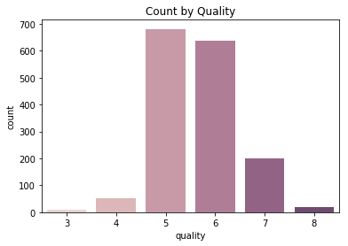

# Wine Quality Regression

A machine learning attempt at predicting wine quality ratings using dataset from the University of Massachusetts

For a full walkthrough of the process, refer to this file and the IPython Notebook.

For the final model and code, they can be found at Wine Quality Regression Condensed Code.py

The dataset used is the wine-quality-red.csv file, retrieved from the University of Massachusetts: 

http://mlr.cs.umass.edu/ml/machine-learning-databases/wine-quality/winequality-red.csv

This is the part 1/3 of this project: Red Wine Quality Regression, head over to White Wine Quality Regression for part 2/3

Now, my thought process:


# Load Modules


```python
import numpy as np # for array operations
import pandas as pd # for graphical display of arrays (basically arrays with row and column names)
import seaborn as sns # for plotting graphs
from matplotlib import pyplot as plt # for customizing graphs
%matplotlib inline # IPython Notebook function, just ignore

from sklearn.model_selection import train_test_split # split data
from sklearn import preprocessing # for scaling
from sklearn.pipeline import make_pipeline # for grouping scaler and model into a wrapper called pipeline, goes into GridSearch
from sklearn.model_selection import GridSearchCV # for cross-validation, determines best hyperparameters
from sklearn.metrics import mean_squared_error, r2_score # performance measures
from sklearn.externals import joblib #for saving model
```

Just to suppress the warnings sklearn gives:


```python
def warn(*args, **kwargs):
    pass
import warnings
warnings.warn = warn
```

Also, for clarity, make numpy print arrays to 2 decimal places


```python
np.set_printoptions(formatter={'float': lambda x: "{0:0.2f}".format(x)})
```

# Load Dataset
We load the dataset into variable data:


```python
# dataset_url = 'http://mlr.cs.umass.edu/ml/machine-learning-databases/wine-quality/winequality-red.csv'
dataset_url = './wine-quality-red.csv'
data = pd.read_csv(dataset_url, sep = ";")
```

# Data Preview
We'll first try to get familiar with how the dataset is structured


```python
print("Data dimensions: "+ str(data.shape) +"\n")

print("The first entries of the dataset: ")
data.head()

print("\nQuantitative properties of each feature: ")
data.describe()
```

    Data dimensions: (1599, 12)
    
    The first entries of the dataset: 


<div>
<style scoped>
    .dataframe tbody tr th:only-of-type {
        vertical-align: middle;
    }

    .dataframe tbody tr th {
        vertical-align: top;
    }
    
    .dataframe thead th {
        text-align: right;
    }
</style>
<table border="1" class="dataframe">
  <thead>
    <tr style="text-align: right;">
      <th></th>
      <th>fixed acidity</th>
      <th>volatile acidity</th>
      <th>citric acid</th>
      <th>residual sugar</th>
      <th>chlorides</th>
      <th>free sulfur dioxide</th>
      <th>total sulfur dioxide</th>
      <th>density</th>
      <th>pH</th>
      <th>sulphates</th>
      <th>alcohol</th>
      <th>quality</th>
    </tr>
  </thead>
  <tbody>
    <tr>
      <th>0</th>
      <td>7.4</td>
      <td>0.70</td>
      <td>0.00</td>
      <td>1.9</td>
      <td>0.076</td>
      <td>11.0</td>
      <td>34.0</td>
      <td>0.9978</td>
      <td>3.51</td>
      <td>0.56</td>
      <td>9.4</td>
      <td>5</td>
    </tr>
    <tr>
      <th>1</th>
      <td>7.8</td>
      <td>0.88</td>
      <td>0.00</td>
      <td>2.6</td>
      <td>0.098</td>
      <td>25.0</td>
      <td>67.0</td>
      <td>0.9968</td>
      <td>3.20</td>
      <td>0.68</td>
      <td>9.8</td>
      <td>5</td>
    </tr>
    <tr>
      <th>2</th>
      <td>7.8</td>
      <td>0.76</td>
      <td>0.04</td>
      <td>2.3</td>
      <td>0.092</td>
      <td>15.0</td>
      <td>54.0</td>
      <td>0.9970</td>
      <td>3.26</td>
      <td>0.65</td>
      <td>9.8</td>
      <td>5</td>
    </tr>
    <tr>
      <th>3</th>
      <td>11.2</td>
      <td>0.28</td>
      <td>0.56</td>
      <td>1.9</td>
      <td>0.075</td>
      <td>17.0</td>
      <td>60.0</td>
      <td>0.9980</td>
      <td>3.16</td>
      <td>0.58</td>
      <td>9.8</td>
      <td>6</td>
    </tr>
    <tr>
      <th>4</th>
      <td>7.4</td>
      <td>0.70</td>
      <td>0.00</td>
      <td>1.9</td>
      <td>0.076</td>
      <td>11.0</td>
      <td>34.0</td>
      <td>0.9978</td>
      <td>3.51</td>
      <td>0.56</td>
      <td>9.4</td>
      <td>5</td>
    </tr>
  </tbody>
</table>
</div>


    Quantitative properties of each feature: 


<div>
<style scoped>
    .dataframe tbody tr th:only-of-type {
        vertical-align: middle;
    }

    .dataframe tbody tr th {
        vertical-align: top;
    }
    
    .dataframe thead th {
        text-align: right;
    }
</style>
<table border="1" class="dataframe">
  <thead>
    <tr style="text-align: right;">
      <th></th>
      <th>fixed acidity</th>
      <th>volatile acidity</th>
      <th>citric acid</th>
      <th>residual sugar</th>
      <th>chlorides</th>
      <th>free sulfur dioxide</th>
      <th>total sulfur dioxide</th>
      <th>density</th>
      <th>pH</th>
      <th>sulphates</th>
      <th>alcohol</th>
      <th>quality</th>
    </tr>
  </thead>
  <tbody>
    <tr>
      <th>count</th>
      <td>1599.000000</td>
      <td>1599.000000</td>
      <td>1599.000000</td>
      <td>1599.000000</td>
      <td>1599.000000</td>
      <td>1599.000000</td>
      <td>1599.000000</td>
      <td>1599.000000</td>
      <td>1599.000000</td>
      <td>1599.000000</td>
      <td>1599.000000</td>
      <td>1599.000000</td>
    </tr>
    <tr>
      <th>mean</th>
      <td>8.319637</td>
      <td>0.527821</td>
      <td>0.270976</td>
      <td>2.538806</td>
      <td>0.087467</td>
      <td>15.874922</td>
      <td>46.467792</td>
      <td>0.996747</td>
      <td>3.311113</td>
      <td>0.658149</td>
      <td>10.422983</td>
      <td>5.636023</td>
    </tr>
    <tr>
      <th>std</th>
      <td>1.741096</td>
      <td>0.179060</td>
      <td>0.194801</td>
      <td>1.409928</td>
      <td>0.047065</td>
      <td>10.460157</td>
      <td>32.895324</td>
      <td>0.001887</td>
      <td>0.154386</td>
      <td>0.169507</td>
      <td>1.065668</td>
      <td>0.807569</td>
    </tr>
    <tr>
      <th>min</th>
      <td>4.600000</td>
      <td>0.120000</td>
      <td>0.000000</td>
      <td>0.900000</td>
      <td>0.012000</td>
      <td>1.000000</td>
      <td>6.000000</td>
      <td>0.990070</td>
      <td>2.740000</td>
      <td>0.330000</td>
      <td>8.400000</td>
      <td>3.000000</td>
    </tr>
    <tr>
      <th>25%</th>
      <td>7.100000</td>
      <td>0.390000</td>
      <td>0.090000</td>
      <td>1.900000</td>
      <td>0.070000</td>
      <td>7.000000</td>
      <td>22.000000</td>
      <td>0.995600</td>
      <td>3.210000</td>
      <td>0.550000</td>
      <td>9.500000</td>
      <td>5.000000</td>
    </tr>
    <tr>
      <th>50%</th>
      <td>7.900000</td>
      <td>0.520000</td>
      <td>0.260000</td>
      <td>2.200000</td>
      <td>0.079000</td>
      <td>14.000000</td>
      <td>38.000000</td>
      <td>0.996750</td>
      <td>3.310000</td>
      <td>0.620000</td>
      <td>10.200000</td>
      <td>6.000000</td>
    </tr>
    <tr>
      <th>75%</th>
      <td>9.200000</td>
      <td>0.640000</td>
      <td>0.420000</td>
      <td>2.600000</td>
      <td>0.090000</td>
      <td>21.000000</td>
      <td>62.000000</td>
      <td>0.997835</td>
      <td>3.400000</td>
      <td>0.730000</td>
      <td>11.100000</td>
      <td>6.000000</td>
    </tr>
    <tr>
      <th>max</th>
      <td>15.900000</td>
      <td>1.580000</td>
      <td>1.000000</td>
      <td>15.500000</td>
      <td>0.611000</td>
      <td>72.000000</td>
      <td>289.000000</td>
      <td>1.003690</td>
      <td>4.010000</td>
      <td>2.000000</td>
      <td>14.900000</td>
      <td>8.000000</td>
    </tr>
  </tbody>
</table>
</div>


We see that the magnitudes of the features are drastically different, later we'll have to standardize the features before we perform any sort of optimization


# Feature Selection
Notice that the Quality column of data is the desired value that we wish to predict. So we split data into X (the features) and y (Quality). 

As we're trying to predict the value of y, it's only natural that we'd want to get to know y better 


```python
y = data['quality']
X = data.drop(['quality'], axis = 1)

sns.countplot(y, palette = sns.cubehelix_palette(8)).set_title('Count by Quality');
```





Quality has a distribution that is approximately normal, however, due to the few data collected for quality below 3 and above 8, it may be hard to predict those values. When we train the model later, we'll remember to use different weights for the classes inversely proportional to their frequency.

Now, we split the data into our test-set and training-set using train_test_split from from sklearn.model_selection


```python
train_data, test_data = train_test_split(data, test_size = 0.2, random_state = 817, stratify = y)
X_train = train_data.drop(['quality'], axis = 1)
X_test = test_data.drop(['quality'], axis = 1)
y_train = train_data['quality']
y_test = test_data['quality']

print("X_train dimensions: ", X_train.shape)
print("X_test dimensions: ", X_test.shape)
print("Test set proportion: %.2f" % (X_test.shape[0]/(X_test.shape[0] + X_train.shape[0])))
print("\nX_train: ")
X_train.head()

df_y_train = pd.DataFrame(y_train, columns=['quality'])
df_y_train.head()
```

    X_train dimensions:  (1279, 11)
    X_test dimensions:  (320, 11)
    Test set proportion: 0.20
    
    X_train: 


<div>
<style scoped>
    .dataframe tbody tr th:only-of-type {
        vertical-align: middle;
    }

    .dataframe tbody tr th {
        vertical-align: top;
    }
    
    .dataframe thead th {
        text-align: right;
    }
</style>
<table border="1" class="dataframe">
  <thead>
    <tr style="text-align: right;">
      <th></th>
      <th>fixed acidity</th>
      <th>volatile acidity</th>
      <th>citric acid</th>
      <th>residual sugar</th>
      <th>chlorides</th>
      <th>free sulfur dioxide</th>
      <th>total sulfur dioxide</th>
      <th>density</th>
      <th>pH</th>
      <th>sulphates</th>
      <th>alcohol</th>
    </tr>
  </thead>
  <tbody>
    <tr>
      <th>797</th>
      <td>9.3</td>
      <td>0.37</td>
      <td>0.44</td>
      <td>1.6</td>
      <td>0.038</td>
      <td>21.0</td>
      <td>42.0</td>
      <td>0.99526</td>
      <td>3.24</td>
      <td>0.81</td>
      <td>10.8</td>
    </tr>
    <tr>
      <th>1386</th>
      <td>7.4</td>
      <td>0.64</td>
      <td>0.07</td>
      <td>1.8</td>
      <td>0.100</td>
      <td>8.0</td>
      <td>23.0</td>
      <td>0.99610</td>
      <td>3.30</td>
      <td>0.58</td>
      <td>9.6</td>
    </tr>
    <tr>
      <th>40</th>
      <td>7.3</td>
      <td>0.45</td>
      <td>0.36</td>
      <td>5.9</td>
      <td>0.074</td>
      <td>12.0</td>
      <td>87.0</td>
      <td>0.99780</td>
      <td>3.33</td>
      <td>0.83</td>
      <td>10.5</td>
    </tr>
    <tr>
      <th>433</th>
      <td>12.3</td>
      <td>0.39</td>
      <td>0.63</td>
      <td>2.3</td>
      <td>0.091</td>
      <td>6.0</td>
      <td>18.0</td>
      <td>1.00040</td>
      <td>3.16</td>
      <td>0.49</td>
      <td>9.5</td>
    </tr>
    <tr>
      <th>874</th>
      <td>10.4</td>
      <td>0.38</td>
      <td>0.46</td>
      <td>2.1</td>
      <td>0.104</td>
      <td>6.0</td>
      <td>10.0</td>
      <td>0.99664</td>
      <td>3.12</td>
      <td>0.65</td>
      <td>11.8</td>
    </tr>
  </tbody>
</table>
</div>


<div>
<style scoped>
    .dataframe tbody tr th:only-of-type {
        vertical-align: middle;
    }

    .dataframe tbody tr th {
        vertical-align: top;
    }
    
    .dataframe thead th {
        text-align: right;
    }
</style>
<table border="1" class="dataframe">
  <thead>
    <tr style="text-align: right;">
      <th></th>
      <th>quality</th>
    </tr>
  </thead>
  <tbody>
    <tr>
      <th>797</th>
      <td>7</td>
    </tr>
    <tr>
      <th>1386</th>
      <td>5</td>
    </tr>
    <tr>
      <th>40</th>
      <td>5</td>
    </tr>
    <tr>
      <th>433</th>
      <td>5</td>
    </tr>
    <tr>
      <th>874</th>
      <td>7</td>
    </tr>
  </tbody>
</table>
</div>


# Standardization

To allow convienient graphing, we will now standardize our dataset


```python
from sklearn.preprocessing import StandardScaler

scaler = StandardScaler().fit(X_train)
X_train_scaled = scaler.transform(X_train)
X_test_scaled = scaler.transform(X_test)

X_train_scaled = pd.DataFrame(X_train_scaled, columns=X_train.columns)
X_test_scaled = pd.DataFrame(X_test_scaled, columns=X_test.columns)

print("\nTraining set stats (note that mean is around 0 and std around 1) :")
X_train_scaled.describe()
print("\nTest set stats (note the deviation of mean from 0 and std from 1): ")
X_test_scaled.describe()
```


    Training set stats (note that mean is around 0 and std around 1) :


<div>
<style scoped>
    .dataframe tbody tr th:only-of-type {
        vertical-align: middle;
    }

    .dataframe tbody tr th {
        vertical-align: top;
    }
    
    .dataframe thead th {
        text-align: right;
    }
</style>
<table border="1" class="dataframe">
  <thead>
    <tr style="text-align: right;">
      <th></th>
      <th>fixed acidity</th>
      <th>volatile acidity</th>
      <th>citric acid</th>
      <th>residual sugar</th>
      <th>chlorides</th>
      <th>free sulfur dioxide</th>
      <th>total sulfur dioxide</th>
      <th>density</th>
      <th>pH</th>
      <th>sulphates</th>
      <th>alcohol</th>
    </tr>
  </thead>
  <tbody>
    <tr>
      <th>count</th>
      <td>1.279000e+03</td>
      <td>1.279000e+03</td>
      <td>1.279000e+03</td>
      <td>1.279000e+03</td>
      <td>1.279000e+03</td>
      <td>1.279000e+03</td>
      <td>1.279000e+03</td>
      <td>1.279000e+03</td>
      <td>1.279000e+03</td>
      <td>1.279000e+03</td>
      <td>1.279000e+03</td>
    </tr>
    <tr>
      <th>mean</th>
      <td>5.874894e-16</td>
      <td>2.178780e-16</td>
      <td>1.197895e-17</td>
      <td>-3.023003e-16</td>
      <td>1.555093e-16</td>
      <td>-1.170118e-16</td>
      <td>6.341031e-17</td>
      <td>3.557037e-14</td>
      <td>4.408601e-15</td>
      <td>-2.130170e-16</td>
      <td>7.446914e-16</td>
    </tr>
    <tr>
      <th>std</th>
      <td>1.000391e+00</td>
      <td>1.000391e+00</td>
      <td>1.000391e+00</td>
      <td>1.000391e+00</td>
      <td>1.000391e+00</td>
      <td>1.000391e+00</td>
      <td>1.000391e+00</td>
      <td>1.000391e+00</td>
      <td>1.000391e+00</td>
      <td>1.000391e+00</td>
      <td>1.000391e+00</td>
    </tr>
    <tr>
      <th>min</th>
      <td>-2.126191e+00</td>
      <td>-2.289244e+00</td>
      <td>-1.398924e+00</td>
      <td>-1.136506e+00</td>
      <td>-1.576773e+00</td>
      <td>-1.426875e+00</td>
      <td>-1.217252e+00</td>
      <td>-3.471959e+00</td>
      <td>-3.639059e+00</td>
      <td>-1.955538e+00</td>
      <td>-1.910806e+00</td>
    </tr>
    <tr>
      <th>25%</th>
      <td>-6.958022e-01</td>
      <td>-7.763849e-01</td>
      <td>-9.363400e-01</td>
      <td>-4.468813e-01</td>
      <td>-3.629695e-01</td>
      <td>-8.516878e-01</td>
      <td>-7.444271e-01</td>
      <td>-5.872507e-01</td>
      <td>-6.393366e-01</td>
      <td>-6.418863e-01</td>
      <td>-8.793918e-01</td>
    </tr>
    <tr>
      <th>50%</th>
      <td>-2.380776e-01</td>
      <td>-4.797096e-02</td>
      <td>-6.257001e-02</td>
      <td>-2.399938e-01</td>
      <td>-1.746207e-01</td>
      <td>-1.806361e-01</td>
      <td>-2.716019e-01</td>
      <td>-1.343884e-02</td>
      <td>-6.492170e-02</td>
      <td>-2.239062e-01</td>
      <td>-2.230370e-01</td>
    </tr>
    <tr>
      <th>75%</th>
      <td>5.629404e-01</td>
      <td>6.244111e-01</td>
      <td>7.598017e-01</td>
      <td>3.585619e-02</td>
      <td>5.558344e-02</td>
      <td>4.904157e-01</td>
      <td>4.671876e-01</td>
      <td>5.760224e-01</td>
      <td>5.733170e-01</td>
      <td>4.329196e-01</td>
      <td>6.208478e-01</td>
    </tr>
    <tr>
      <th>max</th>
      <td>4.339168e+00</td>
      <td>5.891404e+00</td>
      <td>3.740899e+00</td>
      <td>8.932019e+00</td>
      <td>1.095889e+01</td>
      <td>5.379507e+00</td>
      <td>7.145844e+00</td>
      <td>3.632875e+00</td>
      <td>4.466573e+00</td>
      <td>8.016272e+00</td>
      <td>4.183917e+00</td>
    </tr>
  </tbody>
</table>
</div>


    Test set stats (note the deviation of mean from 0 and std from 1): 


<div>
<style scoped>
    .dataframe tbody tr th:only-of-type {
        vertical-align: middle;
    }

    .dataframe tbody tr th {
        vertical-align: top;
    }
    
    .dataframe thead th {
        text-align: right;
    }
</style>
<table border="1" class="dataframe">
  <thead>
    <tr style="text-align: right;">
      <th></th>
      <th>fixed acidity</th>
      <th>volatile acidity</th>
      <th>citric acid</th>
      <th>residual sugar</th>
      <th>chlorides</th>
      <th>free sulfur dioxide</th>
      <th>total sulfur dioxide</th>
      <th>density</th>
      <th>pH</th>
      <th>sulphates</th>
      <th>alcohol</th>
    </tr>
  </thead>
  <tbody>
    <tr>
      <th>count</th>
      <td>320.000000</td>
      <td>320.000000</td>
      <td>320.000000</td>
      <td>320.000000</td>
      <td>320.000000</td>
      <td>320.000000</td>
      <td>320.000000</td>
      <td>320.000000</td>
      <td>320.000000</td>
      <td>320.000000</td>
      <td>320.000000</td>
    </tr>
    <tr>
      <th>mean</th>
      <td>0.010095</td>
      <td>-0.020743</td>
      <td>-0.030767</td>
      <td>-0.031706</td>
      <td>0.012813</td>
      <td>-0.004485</td>
      <td>-0.106759</td>
      <td>0.054522</td>
      <td>0.030016</td>
      <td>0.019418</td>
      <td>-0.069741</td>
    </tr>
    <tr>
      <th>std</th>
      <td>0.980664</td>
      <td>1.016276</td>
      <td>1.005836</td>
      <td>0.851896</td>
      <td>0.922160</td>
      <td>1.013733</td>
      <td>0.845762</td>
      <td>0.918557</td>
      <td>0.923915</td>
      <td>1.059326</td>
      <td>0.994140</td>
    </tr>
    <tr>
      <th>min</th>
      <td>-1.897329</td>
      <td>-2.065117</td>
      <td>-1.398924</td>
      <td>-0.929619</td>
      <td>-1.011727</td>
      <td>-1.235146</td>
      <td>-1.217252</td>
      <td>-2.689489</td>
      <td>-2.745524</td>
      <td>-1.597269</td>
      <td>-1.348217</td>
    </tr>
    <tr>
      <th>25%</th>
      <td>-0.638587</td>
      <td>-0.776385</td>
      <td>-0.897791</td>
      <td>-0.446881</td>
      <td>-0.342042</td>
      <td>-0.755823</td>
      <td>-0.744427</td>
      <td>-0.524653</td>
      <td>-0.575513</td>
      <td>-0.701598</td>
      <td>-0.879392</td>
    </tr>
    <tr>
      <th>50%</th>
      <td>-0.238078</td>
      <td>-0.104003</td>
      <td>-0.165366</td>
      <td>-0.239994</td>
      <td>-0.153693</td>
      <td>-0.276501</td>
      <td>-0.330705</td>
      <td>0.090891</td>
      <td>0.062726</td>
      <td>-0.283618</td>
      <td>-0.363684</td>
    </tr>
    <tr>
      <th>75%</th>
      <td>0.448509</td>
      <td>0.624411</td>
      <td>0.811200</td>
      <td>0.035856</td>
      <td>0.060815</td>
      <td>0.490416</td>
      <td>0.297266</td>
      <td>0.591672</td>
      <td>0.589273</td>
      <td>0.492631</td>
      <td>0.527083</td>
    </tr>
    <tr>
      <th>max</th>
      <td>3.824228</td>
      <td>3.369971</td>
      <td>2.455943</td>
      <td>5.828707</td>
      <td>7.945307</td>
      <td>4.996049</td>
      <td>2.890417</td>
      <td>2.855620</td>
      <td>4.466573</td>
      <td>5.747237</td>
      <td>2.964972</td>
    </tr>
  </tbody>
</table>
</div>


Note that we applied the standard scaler fitted by the training set on the test set as well, this is because we are not supposed to know anything about the test set

Now, on to analyzing the features for the learning algorithms:

First, let's look at the correlation between the variables and Quality


Since the value we're trying to classify is discrete, a scatterplot would not help much.

So, further data graphing (this is where standardization helped):

# Swarmplot

To modify our data into the format allowed by swarmplot, we use melt to transform the dataset

reindexing y_train to concat it with X_train_scaled:


```python
print("y_train before re-indexing: ")
df_y_train.head()
print("y_train after re-indexing")
df_y_train.reset_index(drop=True, inplace=True)
df_y_train.head()
print("The concatenated train_data_scaled: ")
train_data_scaled = pd.concat([X_train_scaled, df_y_train], axis=1)
train_data_scaled.head()
```

    y_train before re-indexing: 


<div>
<style scoped>
    .dataframe tbody tr th:only-of-type {
        vertical-align: middle;
    }

    .dataframe tbody tr th {
        vertical-align: top;
    }
    
    .dataframe thead th {
        text-align: right;
    }
</style>
<table border="1" class="dataframe">
  <thead>
    <tr style="text-align: right;">
      <th></th>
      <th>quality</th>
    </tr>
  </thead>
  <tbody>
    <tr>
      <th>797</th>
      <td>7</td>
    </tr>
    <tr>
      <th>1386</th>
      <td>5</td>
    </tr>
    <tr>
      <th>40</th>
      <td>5</td>
    </tr>
    <tr>
      <th>433</th>
      <td>5</td>
    </tr>
    <tr>
      <th>874</th>
      <td>7</td>
    </tr>
  </tbody>
</table>
</div>


    y_train after re-indexing


<div>
<style scoped>
    .dataframe tbody tr th:only-of-type {
        vertical-align: middle;
    }

    .dataframe tbody tr th {
        vertical-align: top;
    }
    
    .dataframe thead th {
        text-align: right;
    }
</style>
<table border="1" class="dataframe">
  <thead>
    <tr style="text-align: right;">
      <th></th>
      <th>quality</th>
    </tr>
  </thead>
  <tbody>
    <tr>
      <th>0</th>
      <td>7</td>
    </tr>
    <tr>
      <th>1</th>
      <td>5</td>
    </tr>
    <tr>
      <th>2</th>
      <td>5</td>
    </tr>
    <tr>
      <th>3</th>
      <td>5</td>
    </tr>
    <tr>
      <th>4</th>
      <td>7</td>
    </tr>
  </tbody>
</table>
</div>


    The concatenated train_data_scaled: 


<div>
<style scoped>
    .dataframe tbody tr th:only-of-type {
        vertical-align: middle;
    }

    .dataframe tbody tr th {
        vertical-align: top;
    }
    
    .dataframe thead th {
        text-align: right;
    }
</style>
<table border="1" class="dataframe">
  <thead>
    <tr style="text-align: right;">
      <th></th>
      <th>fixed acidity</th>
      <th>volatile acidity</th>
      <th>citric acid</th>
      <th>residual sugar</th>
      <th>chlorides</th>
      <th>free sulfur dioxide</th>
      <th>total sulfur dioxide</th>
      <th>density</th>
      <th>pH</th>
      <th>sulphates</th>
      <th>alcohol</th>
      <th>quality</th>
    </tr>
  </thead>
  <tbody>
    <tr>
      <th>0</th>
      <td>0.562940</td>
      <td>-0.888449</td>
      <td>0.862598</td>
      <td>-0.653769</td>
      <td>-1.032654</td>
      <td>0.490416</td>
      <td>-0.153396</td>
      <td>-0.764611</td>
      <td>-0.447865</td>
      <td>0.910611</td>
      <td>0.339553</td>
      <td>7</td>
    </tr>
    <tr>
      <th>1</th>
      <td>-0.524155</td>
      <td>0.624411</td>
      <td>-1.039136</td>
      <td>-0.515844</td>
      <td>0.264860</td>
      <td>-0.755823</td>
      <td>-0.714876</td>
      <td>-0.326427</td>
      <td>-0.064922</td>
      <td>-0.462752</td>
      <td>-0.785627</td>
      <td>5</td>
    </tr>
    <tr>
      <th>2</th>
      <td>-0.581371</td>
      <td>-0.440194</td>
      <td>0.451412</td>
      <td>2.311619</td>
      <td>-0.279259</td>
      <td>-0.372365</td>
      <td>1.176425</td>
      <td>0.560373</td>
      <td>0.126550</td>
      <td>1.030034</td>
      <td>0.058258</td>
      <td>5</td>
    </tr>
    <tr>
      <th>3</th>
      <td>2.279407</td>
      <td>-0.776385</td>
      <td>1.839165</td>
      <td>-0.171031</td>
      <td>0.076511</td>
      <td>-0.947552</td>
      <td>-0.862633</td>
      <td>1.916656</td>
      <td>-0.958456</td>
      <td>-1.000155</td>
      <td>-0.879392</td>
      <td>5</td>
    </tr>
    <tr>
      <th>4</th>
      <td>1.192312</td>
      <td>-0.832417</td>
      <td>0.965395</td>
      <td>-0.308956</td>
      <td>0.348571</td>
      <td>-0.947552</td>
      <td>-1.099046</td>
      <td>-0.044738</td>
      <td>-1.213751</td>
      <td>-0.044772</td>
      <td>1.277203</td>
      <td>7</td>
    </tr>
  </tbody>
</table>
</div>


Now, we melt the 11 specifications (previously X_train_scaled) into one large column called Stat Type


```python
swarm_data = pd.melt(train_data_scaled, id_vars=["quality"], var_name="Stat Type")
swarm_data.head(10)
```


<div>
<style scoped>
    .dataframe tbody tr th:only-of-type {
        vertical-align: middle;
    }

    .dataframe tbody tr th {
        vertical-align: top;
    }
    
    .dataframe thead th {
        text-align: right;
    }
</style>
<table border="1" class="dataframe">
  <thead>
    <tr style="text-align: right;">
      <th></th>
      <th>quality</th>
      <th>Stat Type</th>
      <th>value</th>
    </tr>
  </thead>
  <tbody>
    <tr>
      <th>0</th>
      <td>7</td>
      <td>fixed acidity</td>
      <td>0.562940</td>
    </tr>
    <tr>
      <th>1</th>
      <td>5</td>
      <td>fixed acidity</td>
      <td>-0.524155</td>
    </tr>
    <tr>
      <th>2</th>
      <td>5</td>
      <td>fixed acidity</td>
      <td>-0.581371</td>
    </tr>
    <tr>
      <th>3</th>
      <td>5</td>
      <td>fixed acidity</td>
      <td>2.279407</td>
    </tr>
    <tr>
      <th>4</th>
      <td>7</td>
      <td>fixed acidity</td>
      <td>1.192312</td>
    </tr>
    <tr>
      <th>5</th>
      <td>5</td>
      <td>fixed acidity</td>
      <td>-0.581371</td>
    </tr>
    <tr>
      <th>6</th>
      <td>6</td>
      <td>fixed acidity</td>
      <td>-1.153527</td>
    </tr>
    <tr>
      <th>7</th>
      <td>5</td>
      <td>fixed acidity</td>
      <td>0.391294</td>
    </tr>
    <tr>
      <th>8</th>
      <td>6</td>
      <td>fixed acidity</td>
      <td>-1.153527</td>
    </tr>
    <tr>
      <th>9</th>
      <td>5</td>
      <td>fixed acidity</td>
      <td>-0.581371</td>
    </tr>
  </tbody>
</table>
</div>


Note that the table is 11 times as long since the 11 features are all melted into 1 column.

The swarmplot:


```python
plt.figure(figsize=(16,8));
sns.swarmplot(x='Stat Type', y='value', hue='quality', data=swarm_data, dodge=True);
plt.ylim(-3, 6);
plt.legend(bbox_to_anchor=(1, 1), loc=2);
```


From the graph, there are no distinct separation (referring to vertical separation) between the overall quality, ie. it's not as simple as for example, higher acidity means higher quality. 

This could pose a threat to our model. We'll see how it goes.

# Heatmap


```python
corrmat = train_data.corr()
plt.figure(figsize=(12,12));
sns.heatmap(corrmat, annot = True, square = True, fmt = '.2f');
```


Nothing too out of the ordinary here either. These features are fine, no risk of having multicollinearity.

# Random Forest

## Cross Validation with Gridsearch


```python
from sklearn.ensemble import RandomForestRegressor

pipeline_rfr = make_pipeline(
    preprocessing.StandardScaler(),
    RandomForestRegressor(random_state = 111)
)

hyperparameters_rfr = {
    'randomforestregressor__max_features' : ['auto', 'sqrt', 'log2'],
    'randomforestregressor__n_estimators': [750, 1000, 1500],
    'randomforestregressor__min_samples_split': [2,4]
}

CV_rfr = GridSearchCV(pipeline_rfr, hyperparameters_rfr, cv=3)

CV_rfr.fit(X_train, y_train)
print("Best Parameters: ", CV_rfr.best_params_)
```


    GridSearchCV(cv=3, error_score='raise',
           estimator=Pipeline(memory=None,
         steps=[('standardscaler', StandardScaler(copy=True, with_mean=True, with_std=True)), ('randomforestregressor', RandomForestRegressor(bootstrap=True, criterion='mse', max_depth=None,
               max_features='auto', max_leaf_nodes=None,
               min_impurity_decr...timators=10, n_jobs=1,
               oob_score=False, random_state=111, verbose=0, warm_start=False))]),
           fit_params=None, iid=True, n_jobs=1,
           param_grid={'randomforestregressor__max_features': ['auto', 'sqrt', 'log2'], 'randomforestregressor__n_estimators': [750, 1000, 1500], 'randomforestregressor__min_samples_split': [2, 4]},
           pre_dispatch='2*n_jobs', refit=True, return_train_score='warn',
           scoring=None, verbose=0)


    Best Parameters:  {'randomforestregressor__max_features': 'sqrt', 'randomforestregressor__min_samples_split': 2, 'randomforestregressor__n_estimators': 1500}


## Grid Search Results
### Run 1:
```python
hyperparameters_rfr = {
    'randomforestregressor__max_features' : ['auto', 'sqrt', 'log2'],
    'randomforestregressor__n_estimators': [200, 500, 1000],
    'randomforestregressor__min_samples_split': [2,4,8]
}

Best Parameters:  {
    'randomforestregressor__max_features': 'sqrt', 
    'randomforestregressor__min_samples_split': 2, 
    'randomforestregressor__n_estimators': 1000
}

R2 score:  0.53691813790181
    
Forced Classification Scores:

    Precision	Recall	F Score	Support
3	0.000000	0.000000	0.000000	2
4	0.000000	0.000000	0.000000	11
5	0.736486	0.801471	0.767606	136
6	0.692308	0.773438	0.730627	128
7	0.758621	0.550000	0.637681	40
8	0.000000	0.000000	0.000000	3
```

### Run 2:
```python
hyperparameters_rfr = {
    'randomforestregressor__max_features' : ['auto', 'sqrt', 'log2'],
    'randomforestregressor__n_estimators': [750, 1000, 1500],
    'randomforestregressor__min_samples_split': [2,4]
}

Best Parameters:  {
    'randomforestregressor__max_features': 'sqrt', 
    'randomforestregressor__min_samples_split': 2, 
    'randomforestregressor__n_estimators': 1500
}

R2 score:  0.5376639543690431

    Precision	Recall	F Score	Support
3	0.000000	0.000000	0.000000	2
4	0.000000	0.000000	0.000000	11
5	0.726667	0.801471	0.762238	136
6	0.678322	0.757812	0.715867	128
7	0.740741	0.500000	0.597015	40
8	0.000000	0.000000	0.000000	3
```

## Final Model


```python
CV_rfr = make_pipeline(
    preprocessing.StandardScaler(),
    RandomForestRegressor(
        max_features = 'sqrt',
        n_estimators = 1500,
        min_samples_split = 2
    )
)

CV_rfr.fit(X_train, y_train)
```


    Pipeline(memory=None,
         steps=[('standardscaler', StandardScaler(copy=True, with_mean=True, with_std=True)), ('randomforestregressor', RandomForestRegressor(bootstrap=True, criterion='mse', max_depth=None,
               max_features='sqrt', max_leaf_nodes=None,
               min_impurity_decrease=0.0, min_impurity_split=None,
               min_samples_leaf=1, min_samples_split=2,
               min_weight_fraction_leaf=0.0, n_estimators=1500, n_jobs=1,
               oob_score=False, random_state=None, verbose=0, warm_start=False))])


## Performance


```python
from sklearn.metrics import confusion_matrix
from sklearn.metrics import precision_recall_fscore_support as score
from sklearn.metrics import r2_score
y_pred_rfr = 0
y_pred_rfr = CV_rfr.predict(X_test)
print("Actual Qualities: ")
y_test.values[0:10]
print("Predicted Qualities: ")
y_pred_rfr[0:10]
print("Forced Classification: ")
y_pred_rfr_int = np.rint(y_pred_rfr)
y_pred_rfr_int[0:10]

print("R2 score: ", r2_score(y_test, y_pred_rfr))
print("Forced Classification Scores:")

cm = confusion_matrix(y_test, y_pred_rfr_int)
     
df_cm = pd.DataFrame(cm, range(3,9), range(3,9))
plt.figure(figsize = (10,7))
sns.heatmap(df_cm, annot=True, fmt='d', square=True)
plt.xlabel('Predicted')
plt.ylabel('Actual')


precision, recall, fscore, support = score(y_test, y_pred_rfr_int);

df_precision = pd.DataFrame(precision, index=range(3, 9), columns=["Precision"])
df_recall = pd.DataFrame(recall, index=range(3, 9), columns=["Recall"])
df_fscore = pd.DataFrame(fscore, index=range(3, 9), columns=["F Score"])
df_support = pd.DataFrame(support, index=range(3, 9), columns=["Support"])

score = pd.concat([df_precision, df_recall, df_fscore, df_support], axis = 1)
score
```

    Actual Qualities: 


    array([6, 5, 6, 5, 6, 6, 6, 6, 7, 7], dtype=int64)


    Predicted Qualities: 


    array([5.26, 5.08, 6.43, 4.96, 5.68, 5.73, 5.98, 5.56, 6.82, 6.81])


    Forced Classification: 


    array([5.00, 5.00, 6.00, 5.00, 6.00, 6.00, 6.00, 6.00, 7.00, 7.00])


    R2 score:  0.5417572298565289
    Forced Classification Scores:


    <matplotlib.figure.Figure at 0x962803d908>


    <matplotlib.axes._subplots.AxesSubplot at 0x9627620cf8>


    Text(0.5,42,'Predicted')


    Text(134.88,0.5,'Actual')


<div>
<style scoped>
    .dataframe tbody tr th:only-of-type {
        vertical-align: middle;
    }

    .dataframe tbody tr th {
        vertical-align: top;
    }
    
    .dataframe thead th {
        text-align: right;
    }
</style>
<table border="1" class="dataframe">
  <thead>
    <tr style="text-align: right;">
      <th></th>
      <th>Precision</th>
      <th>Recall</th>
      <th>F Score</th>
      <th>Support</th>
    </tr>
  </thead>
  <tbody>
    <tr>
      <th>3</th>
      <td>0.000000</td>
      <td>0.000000</td>
      <td>0.000000</td>
      <td>2</td>
    </tr>
    <tr>
      <th>4</th>
      <td>0.000000</td>
      <td>0.000000</td>
      <td>0.000000</td>
      <td>11</td>
    </tr>
    <tr>
      <th>5</th>
      <td>0.731544</td>
      <td>0.801471</td>
      <td>0.764912</td>
      <td>136</td>
    </tr>
    <tr>
      <th>6</th>
      <td>0.685315</td>
      <td>0.765625</td>
      <td>0.723247</td>
      <td>128</td>
    </tr>
    <tr>
      <th>7</th>
      <td>0.750000</td>
      <td>0.525000</td>
      <td>0.617647</td>
      <td>40</td>
    </tr>
    <tr>
      <th>8</th>
      <td>0.000000</td>
      <td>0.000000</td>
      <td>0.000000</td>
      <td>3</td>
    </tr>
  </tbody>
</table>
</div>


Here, we try a few more algorithms:

# SVM
## Cross Validation with Gridsearch


```python
from sklearn.svm import SVR

pipeline_svr = make_pipeline(
    preprocessing.StandardScaler(), 
    SVR()
)

hyperparameters_svr = { 
    "svr__kernel" : ['linear', 'poly', 'rbf', 'sigmoid'],
    "svr__gamma" : [0.03, 0.1, 0.3],
    "svr__C" : [0.1, 0.3, 1]
}
 
CV_svr = GridSearchCV(pipeline_svr, hyperparameters_svr, cv= 3)

CV_svr.fit(X_train, y_train)
print("Best Parameters = ", CV_svr.best_params_)
```


    GridSearchCV(cv=3, error_score='raise',
           estimator=Pipeline(memory=None,
         steps=[('standardscaler', StandardScaler(copy=True, with_mean=True, with_std=True)), ('svr', SVR(C=1.0, cache_size=200, coef0=0.0, degree=3, epsilon=0.1, gamma='auto',
      kernel='rbf', max_iter=-1, shrinking=True, tol=0.001, verbose=False))]),
           fit_params=None, iid=True, n_jobs=1,
           param_grid={'svr__kernel': ['linear', 'poly', 'rbf', 'sigmoid'], 'svr__gamma': [0.03, 0.1, 0.3], 'svr__C': [0.1, 0.3, 1]},
           pre_dispatch='2*n_jobs', refit=True, return_train_score='warn',
           scoring=None, verbose=0)


    Best Parameters =  {'svr__C': 1, 'svr__gamma': 0.1, 'svr__kernel': 'rbf'}


## Grid Search Results

### Run 1
```python
hyperparameters_svr = { 
    "svr__kernel" : ['linear', 'poly', 'rbf', 'sigmoid'],
    "svr__gamma" : [0.1, 0.001, 0.00001],
    "svr__C" : [3, 10, 30]
}

Best Parameters =  {
    'svr__C': 3, 
    'svr__gamma': 0.1, 
    'svr__kernel': 'rbf'
}

R2 score:  0.3845920812148286
    
	Precision	Recall	F Score	Support
3	0.000000	0.000000	0.000000	2
4	0.000000	0.000000	0.000000	11
5	0.696552	0.742647	0.718861	136
6	0.602837	0.664062	0.631970	128
7	0.593750	0.475000	0.527778	40
8	0.000000	0.000000	0.000000	3
```

### Run 2
```python
hyperparameters_svr = { 
    "svr__kernel" : ['linear', 'poly', 'rbf', 'sigmoid'],
    "svr__gamma" : [0.03, 0.1, 0.3],
    "svr__C" : [1, 3, 5]
}

Best Parameters =  {
    'svr__C': 1, 
    'svr__gamma': 0.1, 
    'svr__kernel': 'rbf'
}

R2 score:  0.4060408127341305
    
Precision	Recall	F Score	Support
3	0.000000	0.000000	0.000000	2
4	0.000000	0.000000	0.000000	11
5	0.681529	0.786765	0.730375	136
6	0.594203	0.640625	0.616541	128
7	0.600000	0.375000	0.461538	40
8	0.000000	0.000000	0.000000	3
```
### Run 3 (no change)
```python
hyperparameters_svr = { 
    "svr__kernel" : ['linear', 'poly', 'rbf', 'sigmoid'],
    "svr__gamma" : [0.03, 0.1, 0.3],
    "svr__C" : [0.1, 0.3, 1]
}

Best Parameters =  {
    'svr__C': 1, 
    'svr__gamma': 0.1, 
    'svr__kernel': 'rbf'
}

R2 score:  0.4060408127341305
    
Precision	Recall	F Score	Support
3	0.000000	0.000000	0.000000	2
4	0.000000	0.000000	0.000000	11
5	0.681529	0.786765	0.730375	136
6	0.594203	0.640625	0.616541	128
7	0.600000	0.375000	0.461538	40
8	0.000000	0.000000	0.000000	3
```

svr is maxed out as well.

## Final model:


```python
CV_svr = make_pipeline(
    preprocessing.StandardScaler(), 
    SVR(
        C = 1, 
        gamma = 0.1, 
        kernel = 'rbf'
    )
)

CV_svr.fit(X_train, y_train)
```


    Pipeline(memory=None,
         steps=[('standardscaler', StandardScaler(copy=True, with_mean=True, with_std=True)), ('svr', SVR(C=1, cache_size=200, coef0=0.0, degree=3, epsilon=0.1, gamma=0.1,
      kernel='rbf', max_iter=-1, shrinking=True, tol=0.001, verbose=False))])


## Performance: 


```python
from sklearn.metrics import confusion_matrix
from sklearn.metrics import precision_recall_fscore_support as score
from sklearn.metrics import r2_score

y_pred_svr = 0
y_pred_svr = CV_svr.predict(X_test)
print("Actual Qualities: ")
y_test.values[0:10]
print("Predicted Qualities: ")
y_pred_svr[0:10]
print("Forced Classification: ")
y_pred_svr_int = np.rint(y_pred_svr)
y_pred_svr_int[0:10]

print("R2 score: ", r2_score(y_test, y_pred_svr))
print("Forced Classification Scores:")

cm = confusion_matrix(y_test, y_pred_svr_int)
     
df_cm = pd.DataFrame(cm, range(3,9), range(3,9))
plt.figure(figsize = (10,7))
sns.heatmap(df_cm, annot=True, fmt='d', square=True)
plt.xlabel('Predicted')
plt.ylabel('Actual')


precision, recall, fscore, support = score(y_test, y_pred_svr_int);

df_precision = pd.DataFrame(precision, index=range(3, 9), columns=["Precision"])
df_recall = pd.DataFrame(recall, index=range(3, 9), columns=["Recall"])
df_fscore = pd.DataFrame(fscore, index=range(3, 9), columns=["F Score"])
df_support = pd.DataFrame(support, index=range(3, 9), columns=["Support"])

score = pd.concat([df_precision, df_recall, df_fscore, df_support], axis = 1)
score
```

    Actual Qualities: 


    array([6, 5, 6, 5, 6, 6, 6, 6, 7, 7], dtype=int64)


    Predicted Qualities: 


    array([5.20, 5.10, 6.78, 5.07, 5.84, 5.85, 6.03, 5.59, 6.74, 6.75])


    Forced Classification: 


    array([5.00, 5.00, 7.00, 5.00, 6.00, 6.00, 6.00, 6.00, 7.00, 7.00])


    R2 score:  0.4060408127341305
    Forced Classification Scores:


    <matplotlib.figure.Figure at 0x9626991320>


    <matplotlib.axes._subplots.AxesSubplot at 0x96270121d0>


    Text(0.5,42,'Predicted')


    Text(134.88,0.5,'Actual')


<div>
<style scoped>
    .dataframe tbody tr th:only-of-type {
        vertical-align: middle;
    }

    .dataframe tbody tr th {
        vertical-align: top;
    }
    
    .dataframe thead th {
        text-align: right;
    }
</style>
<table border="1" class="dataframe">
  <thead>
    <tr style="text-align: right;">
      <th></th>
      <th>Precision</th>
      <th>Recall</th>
      <th>F Score</th>
      <th>Support</th>
    </tr>
  </thead>
  <tbody>
    <tr>
      <th>3</th>
      <td>0.000000</td>
      <td>0.000000</td>
      <td>0.000000</td>
      <td>2</td>
    </tr>
    <tr>
      <th>4</th>
      <td>0.000000</td>
      <td>0.000000</td>
      <td>0.000000</td>
      <td>11</td>
    </tr>
    <tr>
      <th>5</th>
      <td>0.681529</td>
      <td>0.786765</td>
      <td>0.730375</td>
      <td>136</td>
    </tr>
    <tr>
      <th>6</th>
      <td>0.594203</td>
      <td>0.640625</td>
      <td>0.616541</td>
      <td>128</td>
    </tr>
    <tr>
      <th>7</th>
      <td>0.600000</td>
      <td>0.375000</td>
      <td>0.461538</td>
      <td>40</td>
    </tr>
    <tr>
      <th>8</th>
      <td>0.000000</td>
      <td>0.000000</td>
      <td>0.000000</td>
      <td>3</td>
    </tr>
  </tbody>
</table>
</div>


Now let's another algorithm: Neural Network

Hopefully it would give us better results

# Neural Network
## Cross Validation with Gridsearch


```python
from sklearn.neural_network import MLPRegressor

pipeline_nn = make_pipeline(
    preprocessing.StandardScaler(), 
    MLPRegressor(max_iter=1000)
)

hyperparameters_nn = {
    'mlpregressor__learning_rate': ["constant", "invscaling", "adaptive"],
    'mlpregressor__hidden_layer_sizes': [(15), (20), (25)],
    'mlpregressor__alpha': [0.03, 0.1, 0.3],
    'mlpregressor__activation': ['logistic', 'tanh', 'relu']
}

CV_nn = GridSearchCV(pipeline_nn, hyperparameters_nn, cv=3)

CV_nn.fit(X_train, y_train)
print("Best Parameters = ", CV_nn.best_params_)
```


    GridSearchCV(cv=3, error_score='raise',
           estimator=Pipeline(memory=None,
         steps=[('standardscaler', StandardScaler(copy=True, with_mean=True, with_std=True)), ('mlpregressor', MLPRegressor(activation='relu', alpha=0.0001, batch_size='auto', beta_1=0.9,
           beta_2=0.999, early_stopping=False, epsilon=1e-08,
           hidden_layer_sizes=(100,), learning_rate='constant',
       ...=True, solver='adam', tol=0.0001, validation_fraction=0.1,
           verbose=False, warm_start=False))]),
           fit_params=None, iid=True, n_jobs=1,
           param_grid={'mlpregressor__learning_rate': ['constant', 'invscaling', 'adaptive'], 'mlpregressor__hidden_layer_sizes': [15, 20, 25], 'mlpregressor__alpha': [0.03, 0.1, 0.3], 'mlpregressor__activation': ['logistic', 'tanh', 'relu']},
           pre_dispatch='2*n_jobs', refit=True, return_train_score='warn',
           scoring=None, verbose=0)


    Best Parameters =  {'mlpregressor__activation': 'tanh', 'mlpregressor__alpha': 0.3, 'mlpregressor__hidden_layer_sizes': 20, 'mlpregressor__learning_rate': 'constant'}


## GridSearch Results
### Run 1:
```python
hyperparameters_nn = {
    'mlpregressor__learning_rate': ["constant", "invscaling", "adaptive"],
    'mlpregressor__hidden_layer_sizes': [(5), (10), (20)],
    'mlpregressor__alpha': [0.00001, 0.001, 0.1],
    'mlpregressor__activation': ['logistic', 'tanh', 'relu']
}

Best Parameters =  {
    'mlpregressor__activation': 'tanh', 
    'mlpregressor__alpha': 0.1, 
    'mlpregressor__hidden_layer_sizes': 20, 
    'mlpregressor__learning_rate': 'invscaling'
}

R2 score:  0.4055030582521735
    
	Precision	Recall	F Score	Support
3	0.000000	0.000000	0.000000	2
4	0.000000	0.000000	0.000000	11
5	0.680272	0.735294	0.706714	136
6	0.598639	0.687500	0.640000	128
7	0.653846	0.425000	0.515152	40
8	0.000000	0.000000	0.000000	3

```

### Run 2:
```python
hyperparameters_nn = {
    'mlpregressor__learning_rate': ["constant", "invscaling", "adaptive"],
    'mlpregressor__hidden_layer_sizes': [(15), (20), (25)],
    'mlpregressor__alpha': [0.03, 0.1, 0.3],
    'mlpregressor__activation': ['logistic', 'tanh', 'relu']
}

Best Parameters =  {
    'mlpregressor__activation': 'tanh', 
    'mlpregressor__alpha': 0.3, 
    'mlpregressor__hidden_layer_sizes': 20, 
    'mlpregressor__learning_rate': 'adaptive'
}

R2 score:  0.4122590801837638
    
	Precision	Recall	F Score	Support
3	0.000000	0.000000	0.000000	2
4	0.666667	0.181818	0.285714	11
5	0.697368	0.779412	0.736111	136
6	0.622378	0.695312	0.656827	128
7	0.636364	0.350000	0.451613	40
8	0.000000	0.000000	0.000000	3

```

## Final Model


```python
CV_nn = make_pipeline(
    preprocessing.StandardScaler(),
    MLPRegressor(
        activation = 'tanh',
        alpha = 0.3,
        hidden_layer_sizes = 20,
        learning_rate = 'adaptive'
    )
)

CV_nn.fit(X_train, y_train)
```


    Pipeline(memory=None,
         steps=[('standardscaler', StandardScaler(copy=True, with_mean=True, with_std=True)), ('mlpregressor', MLPRegressor(activation='tanh', alpha=0.3, batch_size='auto', beta_1=0.9,
           beta_2=0.999, early_stopping=False, epsilon=1e-08,
           hidden_layer_sizes=20, learning_rate='adaptive',
           lea...=True, solver='adam', tol=0.0001, validation_fraction=0.1,
           verbose=False, warm_start=False))])


## Performance


```python
from sklearn.metrics import confusion_matrix
from sklearn.metrics import precision_recall_fscore_support as score
from sklearn.metrics import r2_score

y_pred_nn = 0
y_pred_nn = CV_nn.predict(X_test)
print("Actual Qualities: ")
y_test.values[0:10]
print("Predicted Qualities: ")
y_pred_nn[0:10]
print("Forced Classification: ")
y_pred_nn_int = np.rint(y_pred_nn)
y_pred_nn_int[0:10]

print("R2 score: ", r2_score(y_test, y_pred_nn))

print("Confusion Matrix: ")
cm = confusion_matrix(y_test, y_pred_nn_int)
     
df_cm = pd.DataFrame(cm, range(3,9), range(3,9))

plt.figure(figsize = (10,7));
sns.heatmap(df_cm, annot=True, fmt='d', square=True);
plt.xlabel('Predicted');
plt.ylabel('Actual');


print("Classification Scores: ")
precision, recall, fscore, support = score(y_test, y_pred_nn_int);

df_precision = pd.DataFrame(precision, index=range(3, 9), columns=["Precision"])
df_recall = pd.DataFrame(recall, index=range(3, 9), columns=["Recall"])
df_fscore = pd.DataFrame(fscore, index=range(3, 9), columns=["F Score"])
df_support = pd.DataFrame(support, index=range(3, 9), columns=["Support"])

score = pd.concat([df_precision, df_recall, df_fscore, df_support], axis = 1)
score
```

    Actual Qualities: 


    array([6, 5, 6, 5, 6, 6, 6, 6, 7, 7], dtype=int64)


    Predicted Qualities: 


    array([5.37, 5.45, 6.77, 5.11, 5.40, 5.49, 6.05, 5.76, 6.32, 6.62])


    Forced Classification: 


    array([5.00, 5.00, 7.00, 5.00, 5.00, 5.00, 6.00, 6.00, 6.00, 7.00])


    R2 score:  0.37704509973426115
    Confusion Matrix: 


    <matplotlib.figure.Figure at 0x9626c17550>


    <matplotlib.axes._subplots.AxesSubplot at 0x9626c4c630>


    Text(0.5,42,'Predicted')


    Text(134.88,0.5,'Actual')


    Classification Scores: 


<div>
<style scoped>
    .dataframe tbody tr th:only-of-type {
        vertical-align: middle;
    }

    .dataframe tbody tr th {
        vertical-align: top;
    }
    
    .dataframe thead th {
        text-align: right;
    }
</style>
<table border="1" class="dataframe">
  <thead>
    <tr style="text-align: right;">
      <th></th>
      <th>Precision</th>
      <th>Recall</th>
      <th>F Score</th>
      <th>Support</th>
    </tr>
  </thead>
  <tbody>
    <tr>
      <th>3</th>
      <td>0.000000</td>
      <td>0.000000</td>
      <td>0.000000</td>
      <td>2</td>
    </tr>
    <tr>
      <th>4</th>
      <td>0.500000</td>
      <td>0.090909</td>
      <td>0.153846</td>
      <td>11</td>
    </tr>
    <tr>
      <th>5</th>
      <td>0.687075</td>
      <td>0.742647</td>
      <td>0.713781</td>
      <td>136</td>
    </tr>
    <tr>
      <th>6</th>
      <td>0.588235</td>
      <td>0.703125</td>
      <td>0.640569</td>
      <td>128</td>
    </tr>
    <tr>
      <th>7</th>
      <td>0.666667</td>
      <td>0.300000</td>
      <td>0.413793</td>
      <td>40</td>
    </tr>
    <tr>
      <th>8</th>
      <td>0.000000</td>
      <td>0.000000</td>
      <td>0.000000</td>
      <td>3</td>
    </tr>
  </tbody>
</table>
</div>


The last model we are going to try:

# KNeighbors


```python
from sklearn.neighbors import KNeighborsRegressor

pipeline_kn = make_pipeline(
    preprocessing.StandardScaler(),
    KNeighborsRegressor()
)

hyperparameters_kn = {
    'kneighborsregressor__n_neighbors': [25, 30, 35, 50],
    'kneighborsregressor__weights': ['distance', 'uniform'],
    'kneighborsregressor__algorithm': ['auto', 'ball_tree', 'kd_tree', 'brute']
}

CV_kn = GridSearchCV(pipeline_kn, hyperparameters_kn,cv=3)

CV_kn.fit(X_train, y_train)

print("Best Parameters = ", CV_kn.best_params_)
```


    GridSearchCV(cv=3, error_score='raise',
           estimator=Pipeline(memory=None,
         steps=[('standardscaler', StandardScaler(copy=True, with_mean=True, with_std=True)), ('kneighborsregressor', KNeighborsRegressor(algorithm='auto', leaf_size=30, metric='minkowski',
              metric_params=None, n_jobs=1, n_neighbors=5, p=2,
              weights='uniform'))]),
           fit_params=None, iid=True, n_jobs=1,
           param_grid={'kneighborsregressor__n_neighbors': [25, 30, 35, 50], 'kneighborsregressor__weights': ['distance', 'uniform'], 'kneighborsregressor__algorithm': ['auto', 'ball_tree', 'kd_tree', 'brute']},
           pre_dispatch='2*n_jobs', refit=True, return_train_score='warn',
           scoring=None, verbose=0)


    Best Parameters =  {'kneighborsregressor__algorithm': 'auto', 'kneighborsregressor__n_neighbors': 35, 'kneighborsregressor__weights': 'distance'}


## GridSearch Results
### Run 1:
```python
hyperparameters_kn = {
    'kneighborsregressor__n_neighbors': [10,20,30],
    'kneighborsregressor__weights': ['distance', 'uniform'],
    'kneighborsregressor__algorithm': ['auto', 'ball_tree', 'kd_tree', 'brute']
}

Best Parameters =  {
    'kneighborsregressor__algorithm': 'auto', 
    'kneighborsregressor__n_neighbors': 30, 
    'kneighborsregressor__weights': 'distance'
}

R2 score:  0.48709930370720866
    
	Precision	Recall	F Score	Support
3	0.000000	0.000000	0.000000	2
4	0.000000	0.000000	0.000000	11
5	0.748252	0.786765	0.767025	136
6	0.646259	0.742188	0.690909	128
7	0.689655	0.500000	0.579710	40
8	1.000000	0.333333	0.500000	3
```

### Run 2:
```python
hyperparameters_kn = {
    'kneighborsregressor__n_neighbors': [25, 30, 35, 50],
    'kneighborsregressor__weights': ['distance', 'uniform'],
    'kneighborsregressor__algorithm': ['auto', 'ball_tree', 'kd_tree', 'brute']
}

Best Parameters =  {
    'kneighborsregressor__algorithm': 'auto', 
    'kneighborsregressor__n_neighbors': 35, 
    'kneighborsregressor__weights': 'distance'
}

R2 score:  0.4885513156450002

Precision	Recall	F Score	Support
3	0.000000	0.000000	0.000000	2
4	0.000000	0.000000	0.000000	11
5	0.734694	0.794118	0.763251	136
6	0.647887	0.718750	0.681481	128
7	0.700000	0.525000	0.600000	40
8	1.000000	0.333333	0.500000	3
```

## Final Model


```python
CV_kn = make_pipeline(
    preprocessing.StandardScaler(),
    KNeighborsRegressor(
        algorithm = 'auto',
        n_neighbors = 35,
        weights = 'distance'
    )
)

CV_kn.fit(X_train, y_train)
```


    Pipeline(memory=None,
         steps=[('standardscaler', StandardScaler(copy=True, with_mean=True, with_std=True)), ('kneighborsregressor', KNeighborsRegressor(algorithm='auto', leaf_size=30, metric='minkowski',
              metric_params=None, n_jobs=1, n_neighbors=35, p=2,
              weights='distance'))])


## Performance


```python
from sklearn.metrics import confusion_matrix
from sklearn.metrics import precision_recall_fscore_support as score
from sklearn.metrics import r2_score

y_pred_kn = 0
y_pred_kn = CV_kn.predict(X_test)
print("Actual Qualities: ")
y_test.values[0:10]
print("Predicted Qualities: ")
y_pred_kn[0:10]
print("Forced Classification: ")
y_pred_kn_int = np.rint(y_pred_kn)
y_pred_kn_int[0:10]

print("R2 score: ", r2_score(y_test, y_pred_kn))
print("Forced Classification Scores:")

cm = confusion_matrix(y_test, y_pred_kn_int)
     
df_cm = pd.DataFrame(cm, range(3,9), range(3,9))
plt.figure(figsize = (10,7))


sns.heatmap(df_cm, annot=True, fmt='d', square=True)
plt.xlabel('Predicted')
plt.ylabel('Actual')


precision, recall, fscore, support = score(y_test, y_pred_kn_int)

df_precision = pd.DataFrame(precision, index=range(3, 9), columns=["Precision"])
df_recall = pd.DataFrame(recall, index=range(3, 9), columns=["Recall"])
df_fscore = pd.DataFrame(fscore, index=range(3, 9), columns=["F Score"])
df_support = pd.DataFrame(support, index=range(3, 9), columns=["Support"])

score = pd.concat([df_precision, df_recall, df_fscore, df_support], axis = 1)
score
```

    Actual Qualities: 


    array([6, 5, 6, 5, 6, 6, 6, 6, 7, 7], dtype=int64)


    Predicted Qualities: 


    array([5.41, 5.00, 6.35, 5.05, 5.50, 6.00, 5.83, 5.60, 7.00, 6.69])


    Forced Classification: 


    array([5.00, 5.00, 6.00, 5.00, 5.00, 6.00, 6.00, 6.00, 7.00, 7.00])


    R2 score:  0.4885513156450002
    Forced Classification Scores:


    <matplotlib.figure.Figure at 0x9626c4cd68>


    <matplotlib.axes._subplots.AxesSubplot at 0x9626fcbcc0>


    Text(0.5,42,'Predicted')


    Text(134.88,0.5,'Actual')


<div>
<style scoped>
    .dataframe tbody tr th:only-of-type {
        vertical-align: middle;
    }

    .dataframe tbody tr th {
        vertical-align: top;
    }
    
    .dataframe thead th {
        text-align: right;
    }
</style>
<table border="1" class="dataframe">
  <thead>
    <tr style="text-align: right;">
      <th></th>
      <th>Precision</th>
      <th>Recall</th>
      <th>F Score</th>
      <th>Support</th>
    </tr>
  </thead>
  <tbody>
    <tr>
      <th>3</th>
      <td>0.000000</td>
      <td>0.000000</td>
      <td>0.000000</td>
      <td>2</td>
    </tr>
    <tr>
      <th>4</th>
      <td>0.000000</td>
      <td>0.000000</td>
      <td>0.000000</td>
      <td>11</td>
    </tr>
    <tr>
      <th>5</th>
      <td>0.734694</td>
      <td>0.794118</td>
      <td>0.763251</td>
      <td>136</td>
    </tr>
    <tr>
      <th>6</th>
      <td>0.647887</td>
      <td>0.718750</td>
      <td>0.681481</td>
      <td>128</td>
    </tr>
    <tr>
      <th>7</th>
      <td>0.700000</td>
      <td>0.525000</td>
      <td>0.600000</td>
      <td>40</td>
    </tr>
    <tr>
      <th>8</th>
      <td>1.000000</td>
      <td>0.333333</td>
      <td>0.500000</td>
      <td>3</td>
    </tr>
  </tbody>
</table>
</div>


Let us try a classifier, just for fun:

# Random Forest Classifier
## Cross Validation with Gridsearch


```python
from sklearn.ensemble import RandomForestClassifier

pipeline_rfc = make_pipeline(
    preprocessing.StandardScaler(), 
    RandomForestClassifier()
)

hyperparameters_rfc = { 
    'randomforestclassifier__max_features' : ['auto', 'sqrt', 'log2'],
    'randomforestclassifier__max_depth': [3000, 3500, 4000],
    'randomforestclassifier__n_estimators': [200, 300, 500]
}

CV_rfc = GridSearchCV(pipeline_rfc, hyperparameters_rfc, cv=3)

CV_rfc.fit(X_train, y_train)
print("Best Parameters = ", CV_rfc.best_params_)
```


    GridSearchCV(cv=3, error_score='raise',
           estimator=Pipeline(memory=None,
         steps=[('standardscaler', StandardScaler(copy=True, with_mean=True, with_std=True)), ('randomforestclassifier', RandomForestClassifier(bootstrap=True, class_weight=None, criterion='gini',
                max_depth=None, max_features='auto', max_leaf_nodes=None,
                min_impurity_decrease=0.0, min...n_jobs=1,
                oob_score=False, random_state=None, verbose=0,
                warm_start=False))]),
           fit_params=None, iid=True, n_jobs=1,
           param_grid={'randomforestclassifier__max_features': ['auto', 'sqrt', 'log2'], 'randomforestclassifier__max_depth': [3000, 3500, 4000], 'randomforestclassifier__n_estimators': [200, 300, 500]},
           pre_dispatch='2*n_jobs', refit=True, return_train_score='warn',
           scoring=None, verbose=0)


    Best Parameters =  {'randomforestclassifier__max_depth': 4000, 'randomforestclassifier__max_features': 'log2', 'randomforestclassifier__n_estimators': 500}


## Grid Search Results:
### Run 1: 
```python
hyperparameters_rfc = { 
    'randomforestclassifier__max_features' : ['auto', 'sqrt', 'log2'],
    'randomforestclassifier__max_depth': [3000, 5000, None],
    'randomforestclassifier__n_estimators': [200, 500, 1000]
}

Best Parameters =  {
    'randomforestclassifier__max_depth': 3000, 
    'randomforestclassifier__max_features': 'sqrt', 
    'randomforestclassifier__n_estimators': 500
}

	Precision	Recall	F Score	Support
3	0.000000	0.000000	0.000000	2
4	0.000000	0.000000	0.000000	11
5	0.746667	0.823529	0.783217	136
6	0.691729	0.718750	0.704981	128
7	0.657143	0.575000	0.613333	40
8	1.000000	0.333333	0.500000	3
```

### Run 2:
```python
hyperparameters_rfc = { 
    'randomforestclassifier__max_features' : ['auto', 'sqrt', 'log2'],
    'randomforestclassifier__max_depth': [3000, 3500, 4000],
    'randomforestclassifier__n_estimators': [200, 300, 500]
}

Best Parameters =  {
    'randomforestclassifier__max_depth': 4000, 
    'randomforestclassifier__max_features': 'log2', 
    'randomforestclassifier__n_estimators': 500
}

	Precision	Recall	F Score	Support
3	0.000000	0.000000	0.000000	2
4	0.000000	0.000000	0.000000	11
5	0.741722	0.823529	0.780488	136
6	0.691729	0.718750	0.704981	128
7	0.647059	0.550000	0.594595	40
8	1.000000	0.333333	0.500000	3
```
### Run 3:
```python
hyperparameters_rfc = { 
    'randomforestclassifier__max_features' : ['auto', 'sqrt', 'log2'],
    'randomforestclassifier__max_depth': [1500, 3000, None],
    'randomforestclassifier__n_estimators': [100, 150, 200]
}

Best Parameters =  {
    'randomforestclassifier__max_depth': 3000, 
    'randomforestclassifier__max_features': 'sqrt', 
    'randomforestclassifier__n_estimators': 200
}

Precision	Recall	F Score	Support
3	0.000000	0.000000	0.000000	2
4	0.000000	0.000000	0.000000	11
5	0.740000	0.816176	0.776224	136
6	0.696970	0.718750	0.707692	128
7	0.666667	0.600000	0.631579	40
8	1.000000	0.333333	0.500000	3
```

It looks like performance is maxed out already.

## Final Model:


```python
CV_rfc = RandomForestClassifier(
    max_depth = 3000, 
    max_features = 'sqrt', 
    n_estimators = 200
)
CV_rfc.fit(X_train, y_train)
```


    RandomForestClassifier(bootstrap=True, class_weight=None, criterion='gini',
                max_depth=3000, max_features='sqrt', max_leaf_nodes=None,
                min_impurity_decrease=0.0, min_impurity_split=None,
                min_samples_leaf=1, min_samples_split=2,
                min_weight_fraction_leaf=0.0, n_estimators=200, n_jobs=1,
                oob_score=False, random_state=None, verbose=0,
                warm_start=False)


## Performance
#### Confusion Matrix:


```python
from sklearn.metrics import confusion_matrix
from sklearn.metrics import precision_recall_fscore_support as score

y_pred_rfc = 0
y_pred_rfc = CV_rfc.predict(X_test)
print("Actual Qualities: ")
y_test.values[0:10]
print("Predicted Qualities: ")
y_pred_rfc[0:10]

print("Classification Scores:")

cm = confusion_matrix(y_test, y_pred_rfc)
     
df_cm = pd.DataFrame(cm, range(3,9), range(3,9))
plt.figure(figsize = (10,7))
sns.heatmap(df_cm, annot=True, fmt='d', square=True)
plt.xlabel('Predicted')
plt.ylabel('Actual')


precision, recall, fscore, support = score(y_test, y_pred_rfc);

df_precision = pd.DataFrame(precision, index=range(3, 9), columns=["Precision"])
df_recall = pd.DataFrame(recall, index=range(3, 9), columns=["Recall"])
df_fscore = pd.DataFrame(fscore, index=range(3, 9), columns=["F Score"])
df_support = pd.DataFrame(support, index=range(3, 9), columns=["Support"])

score = pd.concat([df_precision, df_recall, df_fscore, df_support], axis = 1)
score
```

    Actual Qualities: 


    array([6, 5, 6, 5, 6, 6, 6, 6, 7, 7], dtype=int64)


    Predicted Qualities: 


    array([5, 5, 6, 5, 6, 6, 6, 6, 7, 7], dtype=int64)


    Classification Scores:


    <matplotlib.figure.Figure at 0x9627105d30>


    <matplotlib.axes._subplots.AxesSubplot at 0x9627105550>


    Text(0.5,42,'Predicted')


    Text(134.88,0.5,'Actual')


<div>
<style scoped>
    .dataframe tbody tr th:only-of-type {
        vertical-align: middle;
    }

    .dataframe tbody tr th {
        vertical-align: top;
    }
    
    .dataframe thead th {
        text-align: right;
    }
</style>
<table border="1" class="dataframe">
  <thead>
    <tr style="text-align: right;">
      <th></th>
      <th>Precision</th>
      <th>Recall</th>
      <th>F Score</th>
      <th>Support</th>
    </tr>
  </thead>
  <tbody>
    <tr>
      <th>3</th>
      <td>0.000000</td>
      <td>0.000000</td>
      <td>0.000000</td>
      <td>2</td>
    </tr>
    <tr>
      <th>4</th>
      <td>0.000000</td>
      <td>0.000000</td>
      <td>0.000000</td>
      <td>11</td>
    </tr>
    <tr>
      <th>5</th>
      <td>0.733333</td>
      <td>0.808824</td>
      <td>0.769231</td>
      <td>136</td>
    </tr>
    <tr>
      <th>6</th>
      <td>0.686567</td>
      <td>0.718750</td>
      <td>0.702290</td>
      <td>128</td>
    </tr>
    <tr>
      <th>7</th>
      <td>0.676471</td>
      <td>0.575000</td>
      <td>0.621622</td>
      <td>40</td>
    </tr>
    <tr>
      <th>8</th>
      <td>1.000000</td>
      <td>0.333333</td>
      <td>0.500000</td>
      <td>3</td>
    </tr>
  </tbody>
</table>
</div>


# A Comparison Between Random Forest Regressor and Classifier
```python
Classifier:
     Precision   Recall      F Score     Support
3    0.000000    0.000000    0.000000    2
4    0.000000    0.000000    0.000000    11
5    0.740000    0.816176    0.776224    136
6    0.696970    0.718750    0.707692    128
7    0.666667    0.600000    0.631579    40
8    1.000000    0.333333    0.500000    3

Regressor:

    Precision	Recall	    F Score	    Support
3	0.000000	0.000000	0.000000	2
4	0.000000	0.000000	0.000000	11
5	0.726667	0.801471	0.762238	136
6	0.678322	0.757812	0.715867	128
7	0.740741	0.500000	0.597015	40
8	0.000000	0.000000	0.000000	3
```

Very surprisingly, the classifier performs better than the regressor on our dataset, which is weird considering that the classifier treats falsely predicting a quality of 4 as bad/good as falsely predicting a quality of 8 when the actual quality is 3.

I believe that if we had more and higher quality data, the regressor will learn to perform better than the classifier as it takes in the fact that predicting a 4 for a 3 is better than predicting 8 for a 3.

After comparing precision and recall scores of different models, we agree upon a best model

# Best Model:


```python
rfr = make_pipeline(
    preprocessing.StandardScaler(),
    RandomForestRegressor(
        max_features = 'sqrt',
        n_estimators = 1500,
        min_samples_split = 2
    )
)

rfr.fit(X_train, y_train)
```


    Pipeline(memory=None,
         steps=[('standardscaler', StandardScaler(copy=True, with_mean=True, with_std=True)), ('randomforestregressor', RandomForestRegressor(bootstrap=True, criterion='mse', max_depth=None,
               max_features='sqrt', max_leaf_nodes=None,
               min_impurity_decrease=0.0, min_impurity_split=None,
               min_samples_leaf=1, min_samples_split=2,
               min_weight_fraction_leaf=0.0, n_estimators=1500, n_jobs=1,
               oob_score=False, random_state=None, verbose=0, warm_start=False))])


Its performance:
```python
R2 score:  0.5376639543690431

    Precision	Recall	 F Score	Support
3	0.000000	0.000000	0.000000	2
4	0.000000	0.000000	0.000000	11
5	0.726667	0.801471	0.762238	136
6	0.678322	0.757812	0.715867	128
7	0.740741	0.500000	0.597015	40
8	0.000000	0.000000	0.000000	3
```

# Saving the Trained Model


```python
joblib.dump(rfr, 'rf_regressor.pkl')
# To load: rfr2 = joblib.load('rf_regressor.pkl')
```


    ['rf_regressor.pkl']


# Conclusion

Although the data collected was not very good, the features didn't correlate much at all with the quality. However, we were able to achieve satisfactory results with all models, most notibly the Random Forest Regressor with a high recall of 0.8 on the most frequent quality: 5. 

Due to the nature of multiclass classification, a ROC curve was not used to evaluate the models. Rather, we identified the best model to use by inspecting the precision, recall and f scores. 

That concludes the part 1/3 of this notebook, thanks for reading and head over to part 2/3: White Wine Regression where we wrap up some of our hypothesis and assumptions
